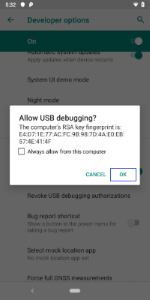

### Enable DXU Service

In order to connect your device to DXU Desktop, the DXU Agent service must be enabled on the device.

The DXU Agent service is enabled by default on pre-Android 9 devices. On Android 9 and above devices, the DXU Agent service will need to be enabled. There are multiple ways to enable DXU Agent.

**Option 1: Scan2Deploy as Device Owner**

The DXU Agent service will automatically be enabled when Scan2Deploy is made Device Owner.

**Option 2: Send an intent from an Enterprise Mobile Management (EMM) Admin Console**

Send the following intent from your EMM to enable or disable DXU Agent:

```
Action: com.datalogic.dxu.action.ENABLE_DXU

Component: com.datalogic.dxu/.plugin.DxuSettingsReceiver

Extras:
    - enableService = true (to enable)
    - enableService = false (to disable)
```

**Option 3: Enable service from the DXU Agent application on the device**
1. Open the DXU Agent application on the device.
2. Tap the **Menu** button to display the menu.
3. Go to **Settings** > **Enable Service**.

    

### Connect via USB

You can connect to a Datalogic mobile computer directly by connecting it
to your PC with a USB cable.

In order to connect your device to DXU via USB, you will need to enable USB debugging on your device.

1. On your device, go to **Settings** > **System** > **About phone** > tap **Build number** 7 times to enable **Developer Options**.

2. Go back to the previous screen in **Settings** and select **Developer Options**.

3. In **Developer Options**, enable **USB debugging**.

    

Once you have enabled USB debugging on your device, you are ready to connect your device to DXU.

1. Launch **DXU** on your PC.

2. Connect your device to your PC with a **USB** cable.

3. On the device, allow the USB debugging connection.

    

4. Click the device’s button in the “**Available Device**” list.

### Connect via Network Manually

If DXU Agent on the device has its **“Enable Discovery Manager”**
feature enabled and **DXU** has “**Automatic Discovery of Devices”**
enabled under **Advanced Settings**, then clicking **Refresh** should
display it in the “Available Device” list if it is in the same subnet.

However, if you want to manually add a device in **DXU** make sure both
device and system are in the same subnet and do this:

1. On DXU’s main view, click the “**Add Device**“ button

    

2. In the “Add Device“ dialog, enter the **IP address** of the device
    and optionally its port if it is has been changed from the default;

    2.1. If the port number is not displayed with the IP address in DXU Agent, it can be found by tapping **Menu** > **Settings** > **Advanced Settings** > **Device HTTP server port**.

    Note: you will see the IP Address and port
   details displayed on DXU’s main view along with the model name, serial
   number, and an illustration of the device.

3. Click the **OK** button to complete.

The added device will display on the left side of the console under
**Available Device**.

 Note: you can also directly connect the device
to DXU using USB.

### Removing a device

To remove a device from the available device list, simply click the exit button (**X**) located at top right of the device.


