## Device Configuration

### Configuration Files

DXU configuration files end with the \*.dxu file extension. They are XML
files that can contain binary data for some configuration items like
wallpaper images.

#### Save a Configuration File

To save a configuration file, do this:

1. From within the “Device Configuration” view, click the “**Save As**”
   button.

   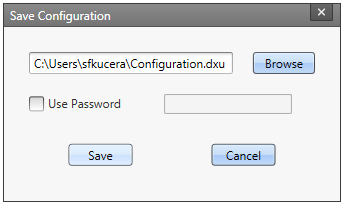

2. You may type the path and file name in the field, or you can click
   the **Browse** button to use a stand file dialog to explore to the
   folder of your choice and type the file name. Unusually, clicking
   the Save button in the Save As dialog does not actually save the
   configuration file yet, but instead returns you to the “**Save
   Configuration**” dialog.

3. *Optionally*, you may check the “**Use Password**” checkbox and type
   a password into the field. This will obligate anyone who opens this
   configuration file in the future to correctly type the password in
   order to open the file.

4. Click the **Save** button.

5. Click the **OK** button to dismiss the confirmation dialog.

#### Open a Configuration File

To load a configuration file saved earlier, do this:

1. Launch DXU.

2. Click the “**Load Configuration**” file. This will open a standard
    file dialog.

3. Explore to your configuration file, select it, and click the
    **Open** button.

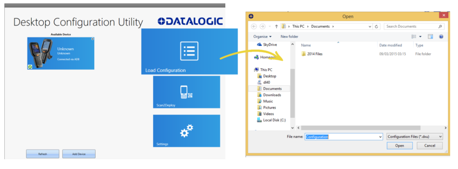

#### Open a Configuration File Which is Authenticated

DXU will display a login prompt when you open a configuration file that
requires authentication. DXU will also display a login prompt when
connecting to a device with a password set in DXU Agent.

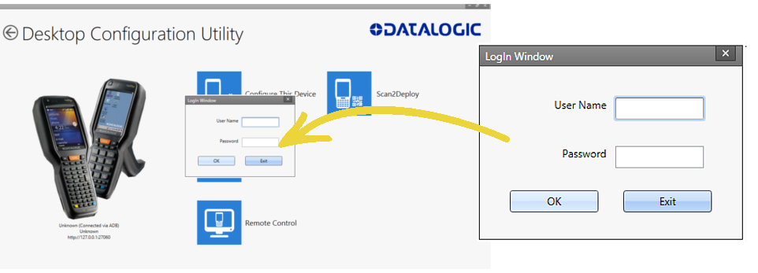

To open a configuration or connect to a device which requires
authentication:

1. Open a configuration file or load the configuration from a connected
   device.

2. Type the user name for this configuration or device into the “**User
   Name**” field.

3. Type the password for this configuration or device into the
   **Password** field.

4. Click the **OK** button.

#### Edit a Configuration File Off-line

You can edit configuration files even when the device they were drawn
from are not connected to DXU. Do this:

1. Open your configuration file.

2. Edit any settings you wish.

3. Either save the result to a new configuration file, or just save to
    the same configuration file.

#### Add Comments to Configuration Settings

Comments can be added to any tab, node, or parameter in the “Device
Configuration” view. Comments are indicated with a small text balloon
icon.

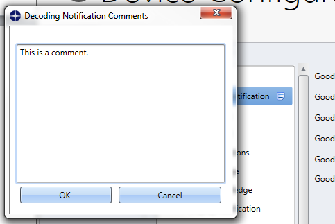

To add a comment:

1. Open a configuration file or load the configuration from a connected
    device.

2. Click the “**Configure This Device**” button.

3. Right-click on any tab, node, or parameter, then select the “**Add
    comment**” command in the context-sensitive menu.

4. Type your comment.

5. Click the **OK** button to save. A small text balloon will appear
    next to the item you commented on.

To edit a comment:

1. Right-click on any item with a small comment icon.

2. Select the “**Edit comment**” command in the context-sensitive menu.

3. Edit your comment.

4. Click the **OK** button to save.

#### Show Comments

You can show all comments in a configuration file in one handy table by
doing this:

1. Open a configuration file or load the configuration from a connected
    device.

2. Click the “**Configure This Device**” button.

3. If do not have comments in this configuration file, add several.

4. Click the “**Show Comments**” button in the button bar.

You can select and edit comments in this table by double-clicking on the
Comment field. Simply click the exit button (**X**) to close the dialog.

### Configure a Device On-line

Once you have added the device to **Desktop Configuration Utility**, you
can click on the listed device under **Available devices** and use
**Configure This Device** option to start configuring the device. There
is also an option to add comments on all the listed settings.

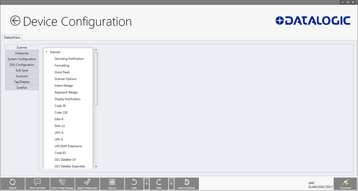

To configure a device that is directly connected via USB:

1. Launch DXU.

2. Connect your Datalogic mobile computer to your PC via a USB cable.

3. Click the button for your connected device in the “Available Device”
    list.

4. Click the “Configure This Device” button.

5. Configure any settings you wish.

6. Save changes to a configuration file of you do not wish to apply
    them to your device.

7. Apply the configuration changes to your device is this is what you
    want to do.

To configure a device that is connected over the network (either
Ethernet or Wi-Fi):

1. Launch DXU.

2. Connect your Datalogic mobile computer to DXU manually, using
    Scan2Deploy labels, or using automatic discovery. (See instructions
    for these methods in this section.)

3. Click the button for your connected device in the “Available Device”
    list.

4. Click the “Configure This Device” button.

5. Configure any settings you wish.

6. Save changes to a configuration file of you do not wish to apply
    them to your device.

7. Apply the configuration changes to your device is this is what you
    want to do.

### Configuring SureLock and SureFox

For Datalogic Android devices, device and browsing lockdown can occur
using SureLock and SureFox, respectively. These lockdown settings can be
set via the DXU desktop. There are two important prerequisites to
configuring these settings when creating a DXU configuration file.

1. The EULA on the device must first be accept. This can be performed
   by first launching SureLock or SureFox on the device and accepting
   the EULA on the device. Future versions of DXU Desktop will allow
   you to remotely accept this EULA just once for your entire
   installation.

2. The “Enable SureLock Password” and/or “Enable SureFox Password”
    fields must have the current password. The Default password is
    “0000”.

For SureLock:

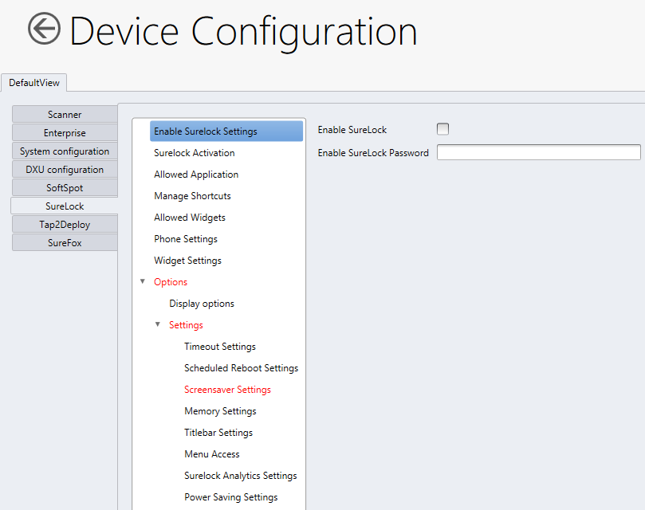

And for SureFox:

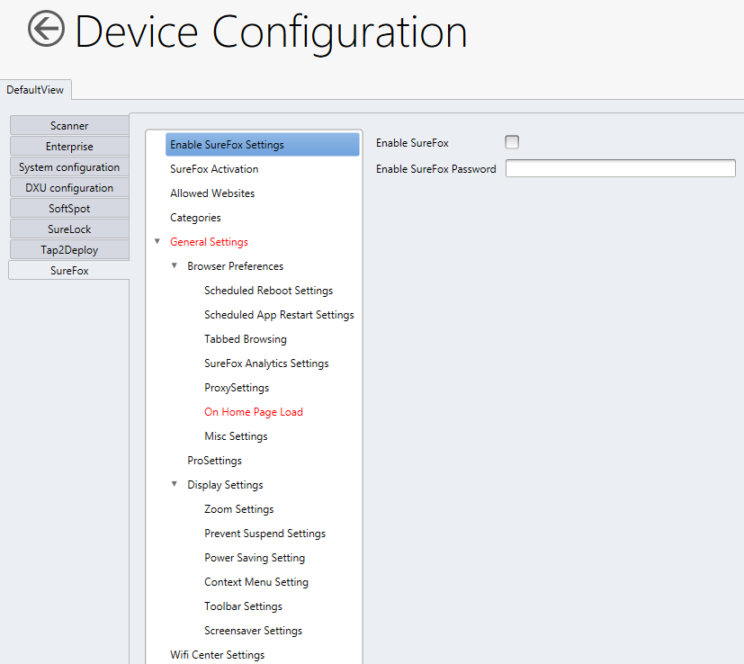

#### Changing the SureLock and/or SureFox Password

To Change the SureLock and/or SureFox password, after completing the
above steps, you can enter the new password in the “Change Password”
field.

For SureLock:

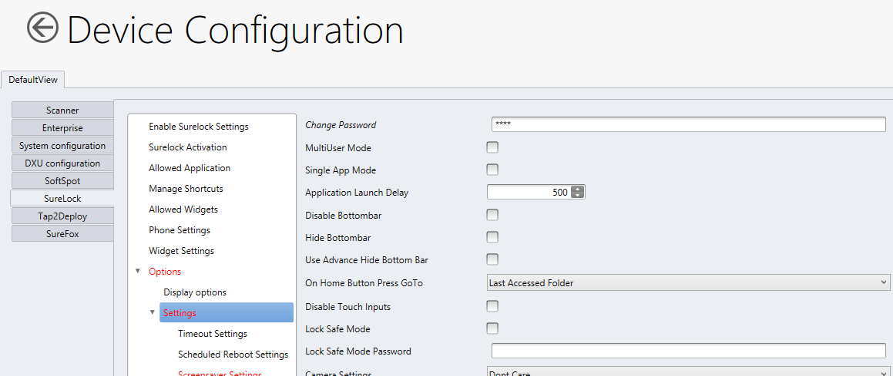

For SureFox:

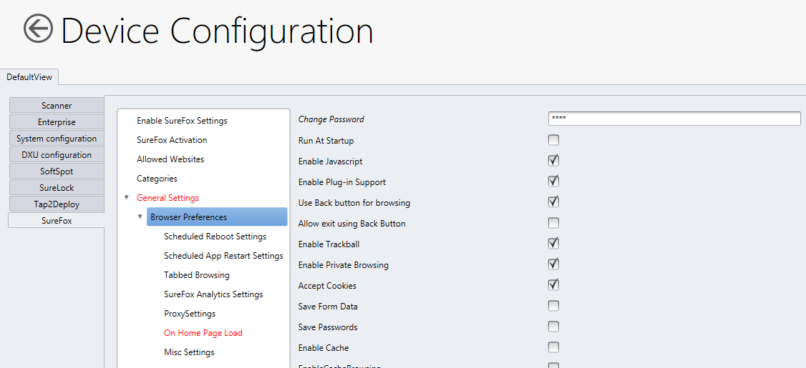

#### Activating the SureLock and/or SureFox License

The activation codes for SureLock and SureFox, provided by 42Gears™,
cannot be used directly by DXU to active your fleet of devices. First,
they must be converted into an *encrypted* activation code.

To activate the SureFox/SureLock license using DXU, users need to enter
the *encrypted* activation code in the “Activation Code” field. To get
the encrypted activation code, users will need to manually activate the
license on one device and then extract the *encrypted* activation code
and use this *encrypted* code to activate surefox/surelock on other
devices from DXU.

For SureLock:

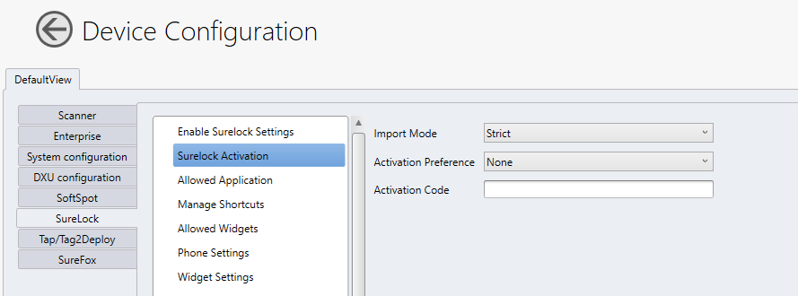

For SureFox:

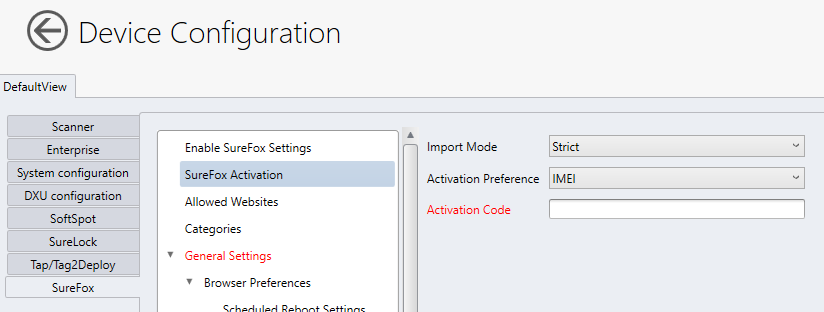

Below are the steps to get the *encrypted* activation code, if you have
the unencrypted activation code.

1. On the device, open the SureFox/SureLock app and then click on the
    screen five times to open the SureFox/SureLock settings. Users will
    be prompted to enter the password after tapping the screen five
    times to open the settings.

2. Manually activate the SureFox/SureLock (**Settings** \> **About**
    **SureFox / About SureLock** **\> Activate)**.

3. After activating the license, export the settings to file
    (**Settings \> Import/Export Settings \> Export to File).**

    You can select the path where you want to save the settings on the
    device and the filename. But make sure to change the file extension
    from ‘**.settings’** to ‘**.txt**’ before saving the settings.

4. Then open the settings file and extract the *encrypted* activation
    code, after “activationcode=”.

   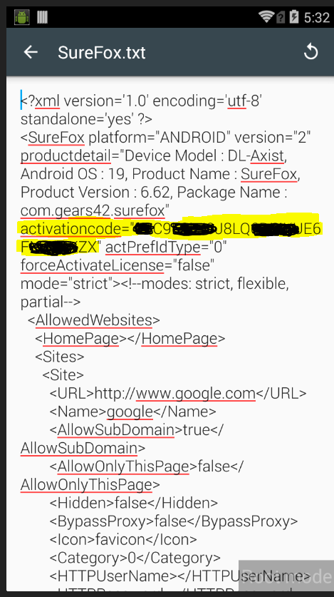

## Device Info

### View Device Info for a Connected Device

You can view information about a device that is connected to DXU. This
information includes the capabilities of the device’s Wi-Fi radio, the
type of barcode scanner it has, the OS version, the battery’s type and
state of charge, the firmware version, and the version of the Datalogic
Enterprise SDK.

To view information about the device you are connected to:

1. Load the configuration from a connected device.

2. Click the “**Device Info**” button.

3. Click the **Back** button (a leftward pointing arrow in a circle)
     to return to DXU’s main view).

### View Device Info Recorded in a Configuration File

You can view information about the device from which a configuration
file was extracted. This information includes the capabilities of the
device’s Wi-Fi radio, the type of barcode scanner it has, the OS
version, the battery’s type and state of charge, the firmware version,
and the version of the Datalogic Enterprise SDK.

To view information about the device from which a configuration file was
extracted:

1. Open a configuration file or load the configuration from a connected
    device.

2. Click the “**Device Info**” button.

3. Click the **Back** button (a leftward pointing arrow in a circle) to
    return to DXU’s main view).

## Remote Control

Remote Control lets you see what is displayed on the screen of a
connected Datalogic mobile computer. This window also includes buttons
to remotely activate the device’s external buttons, and to capture a
screen shot of what is visible on its screen. Note that clicking a
button on screen does not physically press a button, or even trigger it
electrically, but instead sends an event message in the system as if you
had pushed a physical key or tapped a physical button on the touch
screen. Remote Control works through the magic of software.

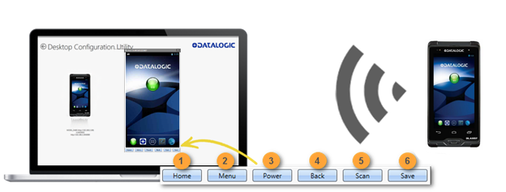

### Unlock the Screen Using Remote Control

You can unlock the screen by dragging your mouse on the Remote Control
screen in the same manner as a user swiping on the device’s screen.

To start **Remote Control** and unlock a device’s screen:

1. Launch **DXU**.

2. Connect the device to DXU either directly using **USB** or on the
    network via **Wi-Fi** or **Ethernet**.

3. Click the device’s button in the “**Available Device**” list.

4. Click the “**Remote Control**” button.

5. If the device is suspended, with its screen off, click the **Power**
    button (3) at the bottom of the **Remote Control** window.

6. Click on the **lock icon** and drag it rightward, releasing it over
    the **unlocked lock icon** at the right edge of the Remote Control
    window.

#### 1\. Home Button

At the bottom of the Remote Control window, the **Home** button
activates the device’s Home button, which switches the display to the
Home screen.

#### 2\. Menu Button

At the bottom of the Remote Control window, the **Menu** button
activates the device’s menu. Some applications have a menu, and others
do not, so this feature depends on which application is active when you
click the Menu button.

#### 3\. Power Button

At the bottom of the Remote Control window, the **Power** button toggles
the device’s power state as if you had pressed the device’s Power
button. If the device is awake, clicking the Power button will turn off
the screen, locking the screen if the device is configured to do that.
If the device’s screen is off, clicking the Power button will resume the
device as if you pushed the device’s Power button.

#### 4\. Back Button

At the bottom of the Remote Control window, the **Back** button takes
the device to the previously viewed screen or application as if you had
tapped the device’s Back button.

#### 5\. Scan Button

At the bottom of the Remote Control window, the **Scan** button
activates the device’s barcode scanner as if you had pressed one of the
Scan keys on the device. There are some limitations: the scanner will
not scan if there is no application running that can receive its data;
the scanner cannot scan if the Camera application is showing its live
preview or taking a photograph or recording a video; and the scanner
will not scan if none of the device’s scan buttons are configured to
scan. However, in general if you have your device configured to scan
barcodes and an application is receiving the data, then the Scan button
will trigger a scan remotely.

#### 6\. Save a Screenshot of Remote Device

At the bottom of the Remote Control window, the **Save** button takes a
screen shot of the remote computer and prompts to save it to your PC.
The default path that DXU saves screen shots is your user folder.

### Set a VNC Password

VNC is a standard protocol for remotely controlling PC’s and other
computers, and it allows the use of a password to prevent unwanted
remote access to computers.

 Caution: the VNC password must match between DXU
console and DXU Agent on the device or a connection will not be made.

#### Set a VNC Password in DXU Agent

You can set a password for VNC in DXU Agent. This field allows VNC
communication to be authenticated, so prying eyes cannot remotely
connect to and control your Datalogic mobile computer. This field is
blank by default.

To set or edit a VNC password in DXU Agent:

1. Resume your mobile computer and unlock its screen.

2. Launch the **DXU Agent** application.

3. Tap the **Menu** button to display the menu.

4. Tap the **Settings** button.

5. Uncheck the “**Enable Service**” checkbox.

    Caution: you must uncheck “Enable Service” before
   you can change any setting in DXU Agent.

6. In the “**VNC Settings**” section, tap the **Password** button.

7. Type a password into the field. It can be numbers, letters, or some
     punctuation characters.

8. Tap the **OK** button.

9. Check the “**Enable Service**” checkbox.

10. Clean up by tapping the **Home** button.

To authenticate Remote Control when a password is set on the device:

1. Launch **DXU**.

2. Connect the device to DXU either directly using **USB** or on the
    network via **Wi-Fi** or **Ethernet**.

3. Click the device’s button in the “**Available Device**” list.

4. Click the “**Remote Control**” button.

5. Type the device’s **VNC password** into the field, and then click
    the **OK** button.

### Set or Edit the VNC Authentication Password from DXU

You can change a device’s VNC password from DXU. It is a configuration
parameter in the Device Configuration view. To do this:

1. Open a configuration file or load the configuration from a connected
    device.

2. Click the “Configure This Device” button.

3. Click the “DXU Configuration” tab.

4. Click the “General Settings” node in the middle pane.

5. Type a password into the “VNC Authentication Password” field, or
    edit the value in that field.

6. Note: the value in this field is encrypted for security. Once
    entered, it will be displayed as asterisks.

7. Click the **Back** button (a leftward pointing arrow in a circle) to
    return to DXU’s main view).

## Firmware Utility

You can update a Datalogic mobile computer’s firmware from DXU. DXU
provides several options, such as performing a “Silent Install” where no
user interaction is required on the device, and performing a “Force
Update” where the firmware is reinstalled even if the device reports
that it already has the same version installed. Also, you can specify
whether a factory data reset or an enterprise reset is performed after
updating the firmware, or if the update will simply reboot the device
without performing an update.

 Note: DXU firmware update is not the only way
to update firmware on Datalogic mobile computers. DXU’s firmware update
capability works only with connected devices. If you need a method that
can update firmware on many devices remotely, especially if they are not
connected to a network, then other methods may suit your needs better.
Please consult your device’s user reference guide for other firmware
update methods.

 Note: customarily firmware update is referred
to as “update” on Datalogic mobile computers that use Microsoft Windows
operating systems, and it is referred to as “upgrade” on Datalogic
mobile computers that use the Android operating system. These terms are
used because the creators of these operating systems use these terms,
but the terms essentially mean the same thing.

### Silent Install

This option allows you to perform an image update that does not require
any user interaction on the device. If left unchecked, the user will be
prompted to perform the update, but they have the option to cancel the
update. This checkbox is not checked by default.

### Force Update

This option allows you to perform a full upgrade of the firmware
regardless of what is installed on the device. By default, the firmware
upgrade utility will compare the version of the image file with what is
already running on the device, and if they match it will skip updating.
This is done to save time and prevent inconvenience for most users in
the field. However, in rare circumstances a firmware image can become
corrupted in the field, and this option allows a DXU administrator to
perform a full firmware upgrade, disregarding the version reported by
the device.

### Factory Data Reset After Installing Firmware

A factory data reset is a full reset of the device intended to return it
to the condition it would be in if it were just leaving the factory.
This reset deletes all user data and settings, deletes installed
applications, and resets the device’s real-time clock to its default
date and time. Data on microSD cards is not affected.

### Enterprise Reset After Installing Firmware

An enterprise reset is much like a factory data reset, except that it
does not reset network connects such as Wi-Fi settings, and it does not
reset custom desktop wallpaper graphics and splash screen graphics. In
every other way, it resets the device, including restoring flash memory
to factory defaults, removing installed applications, deleting user
data, and resetting the date and time to default levels.

### Update Firmware on a Connected Device

You must first connect to a device to update its firmware with DXU. The
connection can be either with USB, or over a network using Wi-Fi or
Ethernet.

To perform a firmware update with DXU:

1. Launch **DXU**.

2. Connect the device to DXU either directly using **USB** or on the
    network via **Wi-Fi** or **Ethernet**.

3. Click the device’s button in the “**Available Device**” list.

4. Click the “**Firmware Utility**” button.

5. Click the **Browse** button to open a standard file dialog to browse
    for and select a suitable firmware image file.

    Caution: DXU will automatically filter your view
   of file types to those that are compatible with your device.

6. Navigate to your firmware image file, select it, and click the
    **Open** button.

7. (Optional) Check the “**Silent Install**” checkbox if you wish to
    perform a firmware update that does not require user interaction on
    the device.

8. (Optional) Check the “**Force Update**” checkbox if you wish to
    force a complete reinstallation of this image on the device.

9. (Optional) Select an option from the “**Reset Type**” menu if you
    wish to perform a factory data reset after the image update
    finishes, or if you wish to perform an enterprise reset after the
    image update finishes, or if you just want to have the device reboot
    without resetting at all.

10. Click the **Update** button.
