### Features

Datalogic DXU is a an utility to configure devices in the following ways:

* Scan2Deploy
* Device Configuration
* Device Info
* Firmware Update
* Remote Control

DXU can connect directly to individual Datalogic mobile
computers that connect either directly to a PC via USB or remotely over
a network, either via Ethernet or Wi-Fi. DXU reports information about
currently connected devices.

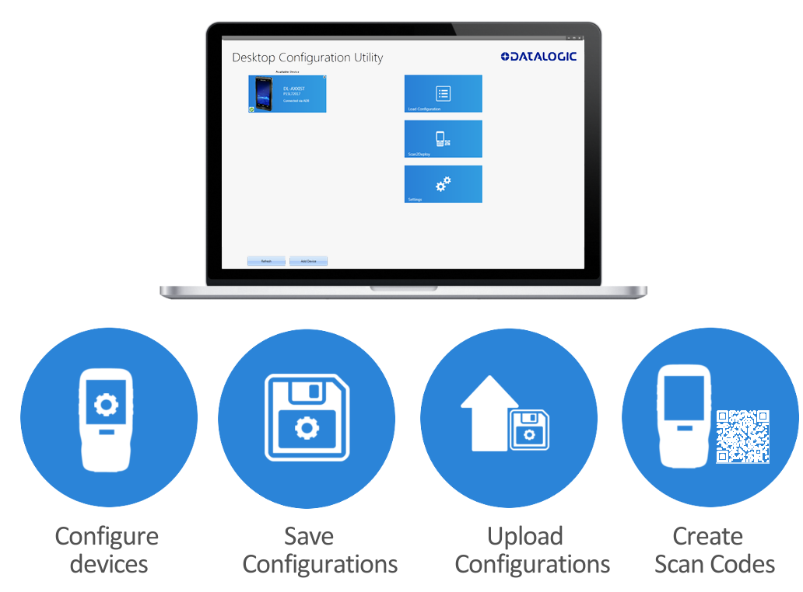

DXU can configure a wide variety of device parameters, including the
scanner and most decoding parameters, the touch screen and the keyboard,
interfaces such as NFC, Wi-Fi, Bluetooth, USB, and Ethernet, device
settings such as date, time, time zone, and power management, and
security settings such as password access. DXU can also configure
communication parameters between the application that runs on a PC and
the client applications that run on Datalogic mobile computers.

DXU offers a method to print out barcodes that Datalogic mobile
computer users can scan to quickly connect to DXU called Scan2Deploy.

DXU offers remote control capabilities for remote troubleshooting. There
are some limitations to this (not too remote), but it allows a DXU
administrator an opportunity to remotely operate a Datalogic mobile
computer to check settings, configure the device using its own user
interface, and to see what a user sees.

### How DXU Works

DXU is really two applications working together. The DXU desktop
application runs on a Windows PC, providing convenient UI to configure
Datalogic mobile computers. An application runs continuously on
Datalogic mobile computers to extract current configuration settings and
send them to the DXU desktop application, and to receive updated
settings from the DXU desktop application and apply those configuration
settings to the mobile computer.

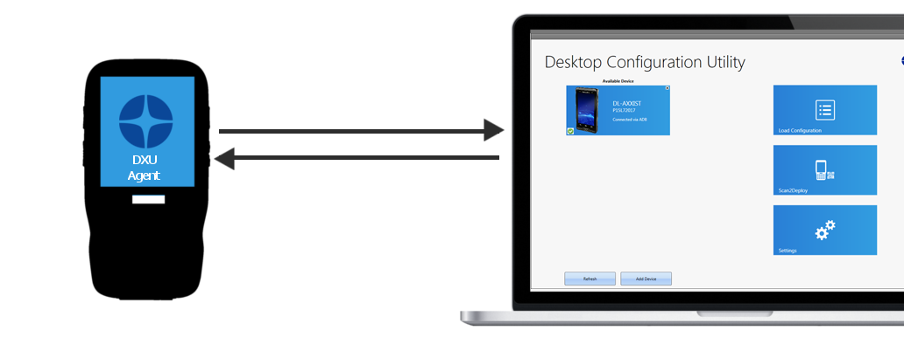

DXU configurations are stored as configuration files on the PC, and are
transmitted to and from the Datalogic mobile computer as XML web pages.
XML is a standard data format that is widely used for a variety of
applications on the internet. Some data is encrypted in the XML file to
protect your sensitive data from prying eyes, but most data which is not
sensitive is transmitted in plain text that can be easily viewed and
analyzed.

DXU can connect directly to devices that are plugged into your PC via
USB, including those inserted into a powered dock which is connected to
your PC via USB. DXU can also connect to devices on your network. DXU
supports connecting only to devices in the same subnet as the PC running
DXU. Datalogic mobile computers connected to Wi-Fi wireless access
points can connect to DXU as long as the AP is on the same subnet as
your PC. Datalogic mobile computers connected over Ethernet can connect
to DXU too as long as they connect on the same subnet as your PC. Ask
your network specialists for more information.

### Supported Datalogic Mobile Computers

DXU supports select Datalogic mobile computers that run Android and Windows CE operating
systems.

#### Supported Android devices

* Joya Touch A6
* Joya Touch A6 Healthcare
* Skorpio X4
* Falcon X4
* DL-Axist

#### Supported Windows CE devices

* Skorpio X4
* Falcon X4
* Skorpio X3
* Falcon X3 / X3+

### DXU Desktop Tasks

#### Available Devices Page

The Available Devices list displays devices which are either currently
connected, have been connected since launching DXU, or were manually
connected at some time in the past. You can refresh the view to
automatically show devices or hide devices which connect while you work
on another device. In general, they should appear automatically as they
connect.

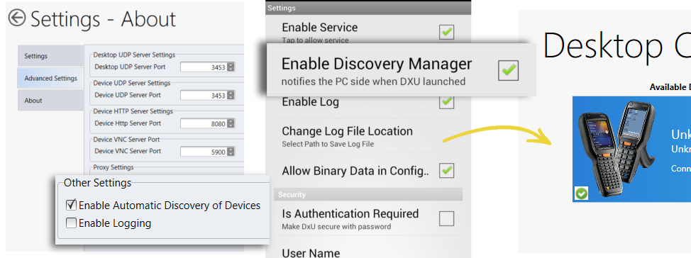

By default, “No Devices Available” will display when no devices announce
themselves to DXU either when they connect via USB or when they connect
over a network. Simply connecting a Datalogic mobile computer to a
network, even on the same subnet as the PC running DXU, will not
automatically display as being available. The device must try to connect
to DXU, which sends an announcement packet to DXU. However, connecting a device to the
PC running DXU via USB will automatically display it in DXU. You may
also check the “Enable Automatic Discovery of Devices” checkbox in DXU’s
Settings view to automatically see any device that connects to the
network, but remember that automatic discovery is restricted to
discovering devices only within your PC’s subnet.

To configure a connected device, you simply click its button under
Available Devices to load its configuration into DXU.

To return to the DXU main window, click the Back button (generally, a
leftward pointing arrow in a circle).

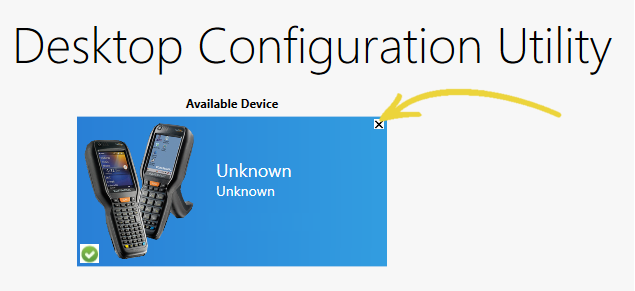

##### Refresh

This button manually refreshes the display of currently connected
devices. This can overcome problems with the automatic display of
devices as they connect, and it can remove devices from the list that
are not currently connected.

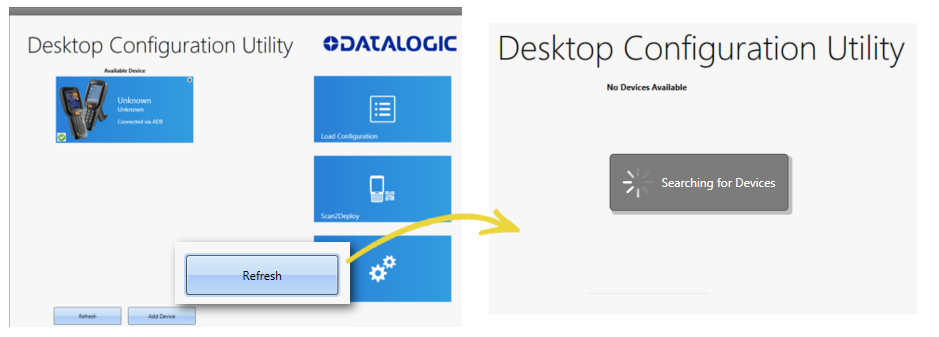

##### Add Device

This button opens the “Add Device” dialog which allows you to type the
IP address of a device. This dialog does not support DNS naming of
devices. You can also use a custom TCP port if you have configured your
device to use one in DXU Agent. For convenience, this field
pre-populates with your PC’s IP subnet. You need only type in the last
number of your device’s IP address if it is in the same subnet as your
PC.

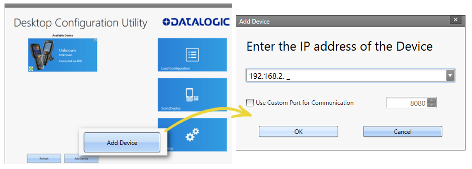

This dialog allows you to manually connect to devices running DXU Agent
that are either inside your PC’s subnet or outside it. The limitation is
that devices on other subnets must be on a subnet that is routable from
your PC’s subnet. Consult with your network expert for more information.

Once connected, devices that respond to DXU’s query over the network
will display in the Available Devices list.

##### Load Configuration

Clicking the “Load Configuration” button opens a standard file dialog
that allows you to explore for and select a DXU configuration file.
Loading a configuration allows you to edit a device’s configuration when
the device is not connected to DXU. This also allows you to save copies
of this configuration to new locations or file names, so you can edit a
copy of the configuration while leaving the original configuration
unchanged.

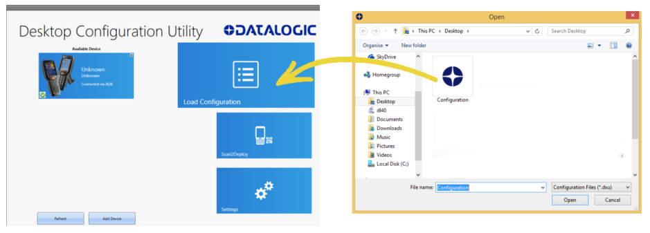

To load a configuration:

1. Click the “Load Configuration” button.

2. Explore to any folder where DXU configuration files are located,
    then select any configuration file you wish. You can double-click it
    to streamline opening it.

3. Click the Open button.

Note that the default location is your user directory on your PC, but
DXU remembers the last directory you opened a DXU configuration file,
and always starts in that directory the next time you wish to open
another DXU configuration file.

#### Settings View

The **Settings** view is opened by clicking the Settings button on DXU’s
main view. This view includes controls which should seldom need to be
changed, such as the language that DXU displays in, TCP ports used to
communicate with remote devices, and the About tab that displays DXU’s
version.

##### Settings Tab

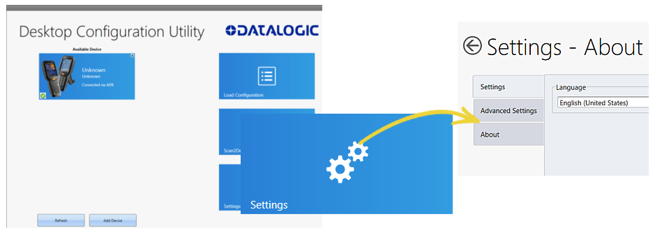

###### Language Section

The **Language** section lets you switch the language that strings in DXU
are displayed in. The default language is US English, but you may choose
Italian, Chinese Simplified, or Chinese Traditional. Additional
languages may be added later without notice.

##### Advanced Settings Tab

The “Advanced Settings” tab lets you change network communications
settings that DXU uses to communicate several types of information with
remote computers that are being configured.

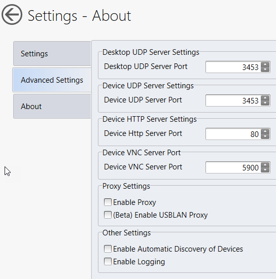

###### Desktop UDP Service Port

The “Desktop UDP Server Port” filed must be set to the same value as the
matching ports on the remote device to ensure communication and remote
configuration.

###### Device UDP Service Port

The “Desktop UDP Server Port” field must be set to the same value as the
matching ports on the remote device to ensure communication and remote
configuration.

###### Device HttpServer Port

The “Device HTTP Server Port” field must be set to the same value as the
matching ports on the remote device to ensure communication and remote
configuration.

###### Device VNC Server Port

The “Device VNC Server Port” field must be set to the same value as the
matching ports on the remote device to enable Remote Control.

###### Enable Proxy

The “Enable Proxy” setting, if checked, will use your PC’s global proxy
settings to connect to external IP addresses.

###### (Beta) Enable USBLAN Proxy

This feature is currently released in Beta form. It allows you to
connect X4 and X3 generation CE devices running in USBLAN mode to a PC
running DXU via USB cable and access HTTP servers located on the
attached network (LAN or Internet). The following limitations are
present:

* The PC must not have any other services using UDP port 53

* The PC must not have any other services using TCP port 80

* HTTPS connections are not supported

* No feedback is provided if UDP port 53 or TCP port 80 is already in
  use on your system. It is recommended that you use the resmon.exe
  tool built into Windows to determine if other processes are using
  these ports before using this feature.

##### About Tab

The About tab displays DXU’s version. This is likely the first question
that Datalogic technical support may ask you if you call in with a
question.  The About tab also displays a link to the online DXU manual.

#### Desktop Configuration Utility - Device View

This is the view you see when you click on a device’s button in the
“Available Device” list. It displays a large picture of your device’s
model, along with the model name and serial number.

##### Configure this Device Button

This button lets you configure individual parameter values on your
device from DXU. The types of settings include scanner settings,
enterprise settings, system configuration settings, DXU Agent
configuration settings, Soft Spot settings, Tap2Deploy device-side
settings, and SureLock settings. Other settings may be added in the
future. Additional settings may be available depending on hardware
options installed on your Datalogic mobile computer, and may depend on
software installed on your mobile computer.

##### Device Info Button

Clicking this button displays the Device Info view, which displays your
device’s Wi-Fi radio capabilities, the type of barcode scanner on the
device, the operating system version, battery information, the firmware
version installed on your device, and the version of the enterprise SDK,
which may be important for troubleshooting.

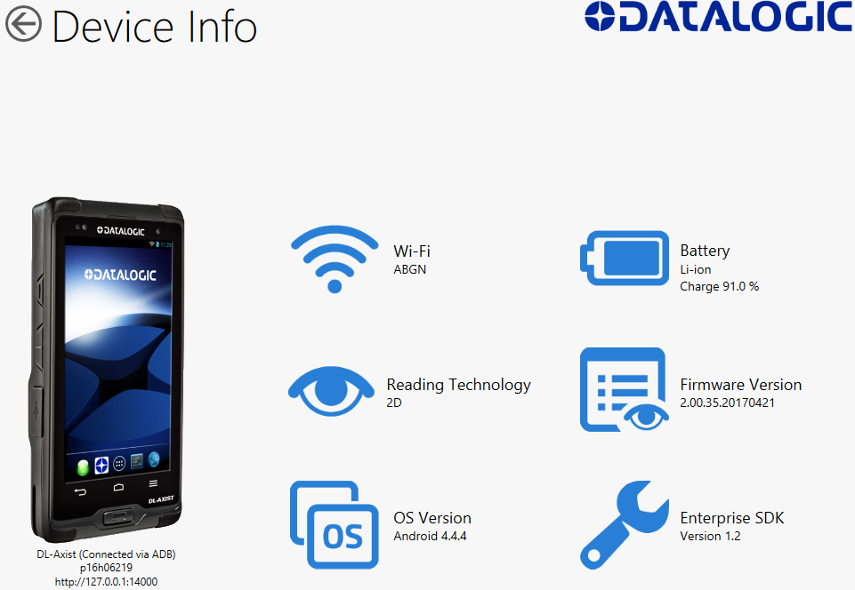

##### Remote Control Button

Clicking this button opens a Remote Control window that displays what is
visible on the screen of the device you are currently connected to. This
window also includes buttons to remotely activate the devices external
buttons, and to capture a screen shot of what is visible on its screen.

##### Firmware Utility Button

Clicking this button opens the “Firmware Utility” dialog, which you can
use to update the firmware on your device.

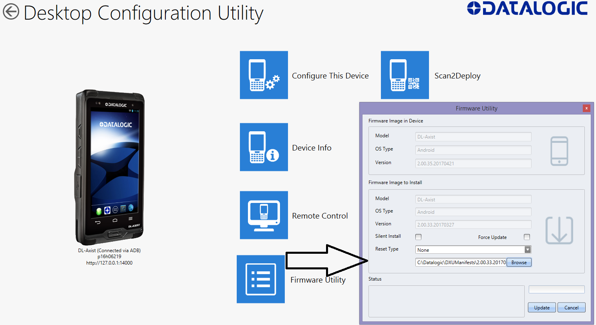

### Configure DXU

There are many ways to configure DXU, such as changing its language,
changing the TCP/IP ports used to communicate with DXU Agent on remote
devices, enabling automatic discovery of devices, enabling logging, and
resetting DXU’s settings back to their default values.

#### Configure DXU’s Language

DXU can display its controls in several languages. US English is the
default, but you can also select Italian, Chinese Simplified or Chinese
Traditional.

To change DXU’s language:

1. In DXU’s main view, click the **Settings** button.

   

2. Select the language you prefer in the **Language** menu.

3. Click the **Back** button (a leftward pointing arrow in a circle) to
    return to DXU’s main view.

#### Configure DXU Communication Settings

You can configure the TCP/IP ports used by DXU to communicate with DXU
Agent on Datalogic mobile computers. Configure these settings only if
you understand how these changes affect your network. Consult your
network expert for more information.

To configure DXU’s UDP and TCP ports:

1. In DXU’s main view, click the **Settings** button.

2. Click the “**Advanced Settings**” tab.

    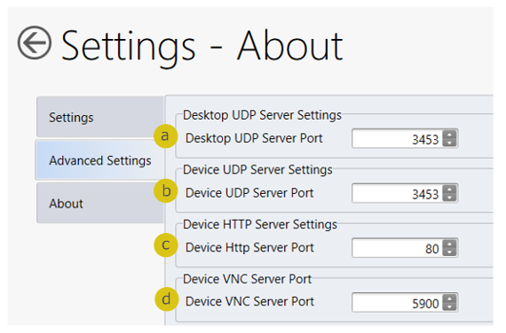

3. Edit the port values to match the ports used by **DXU Agent** on
    your devices:

4. The “Desktop UDP Server Port” configures the UDP port for the DXU
    server running on the on the console PC. It is set to UDP port 3453
    by default.

5. The “Device UDP Server Port” configures the UDP port for the DXU
    Agent server running on the device. It is set to UDP port 3453 by
    default.

6. The “Device HTTP Server Port” configures the TCP port for the DXU
    Agent server running on the device. It is set to TCP port 80 by
    default, like common web servers.

7. The “Device VNC Server Port” configures the TCP port for VNC running
    on the device. It is set to TCP port 5900, like common VNC servers.

8. Click the **Back** button (a leftward pointing arrow in a circle) to
    return to DXU’s main view).

#### Enable Automatic Discovery of Devices

You can enable the automatic discovery of Datalogic mobile computers by
DXU. This is not enabled by default.

 Warning: do not enable automatic discovery if
you have more than one user of DXU console in your subnet, or you risk
having two DXU administrators changing the settings on any particular
device in your subnet at once. DXU will warn you if it launches and
detects another instance of DXU already running in your subnet.

To enable automatic discovery of devices:

1. In DXU’s main view, click the **Settings** button.

2. Click the “**Advanced Settings**” tab.

3. Check the “**Enable Automatic Discovery of Devices**” checkbox.

4. Click the **Back** button (a leftward pointing arrow in a circle) to
    return to DXU’s main view).

#### Enable Logging on the DXU Console PC

DXU can log its activities, and this can be very helpful for technical
support to help you diagnose those unexpected problems that always seem
to pop up after software is released to actual users. Logging is not
enabled by default. DXU’s default log file location, once enabled, is in
your user directory at “C:\\Users\\\<user\>\\AppData\\Roaming\\Datalogic
DXU”.

To enable logging:

1. In DXU’s main view, click the **Settings** button.

2. Click the “**Advanced Settings**” tab.

   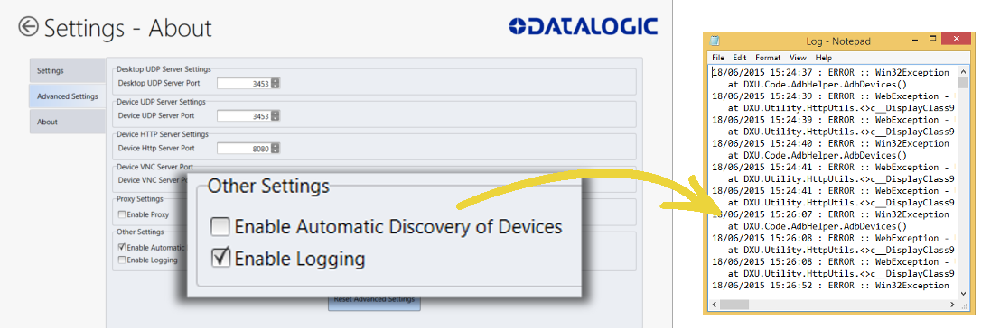

3. Check the “**Enable Logging**” checkbox.

4. Click the **Back** button (a leftward pointing arrow in a circle) to
    return to DXU’s main view).

#### Reset Advanced Settings to Defaults

You can reset DXU’s Advanced Settings to their default values. To do
this:

1. In DXU’s main view, click the **Settings** button.

2. Click the “**Advanced Settings**” tab.

3. Click the “**Reset Advanced Settings**” button.

4. Click the **Yes** button to confirm.

5. Click the **Back** button (a leftward pointing arrow in a circle) to
    return to DXU’s main view).

### Connect to devices

#### Enable DXU Service

In order to connect your device to DXU Desktop, the DXU Agent service must be enabled on the device.

The DXU Agent service is enabled by default on pre-Android 9 devices. On Android 9 and above devices, the DXU Agent service will need to be enabled. There are multiple ways to enable DXU Agent.

**Option 1: Scan2Deploy as Device Owner**

The DXU Agent service will automatically be enabled when Scan2Deploy is made Device Owner.

**Option 2: Send an intent from an Enterprise Mobile Management (EMM) Admin Console**

Send the following intent from your EMM to enable or disable DXU Agent:

```
Action: com.datalogic.dxu.action.ENABLE_DXU

Component: com.datalogic.dxu/.plugin.DxuSettingsReceiver

Extras:
    - enableService = true (to enable)
    - enableService = false (to disable)
```

**Option 3: Enable service from the DXU Agent application on the device**
1. Open the DXU Agent application on the device.
2. Tap the **Menu** button to display the menu.
3. Go to **Settings** > **Enable Service**.

    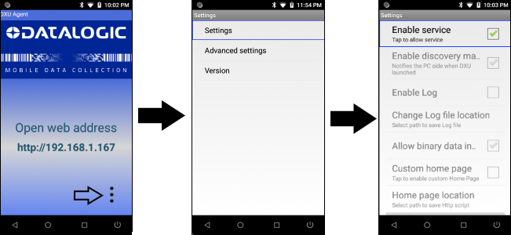


#### Connect to a Device via USB

You can connect to a Datalogic mobile computer directly by connecting it
to your PC with a USB cable.

In order to connect your device to DXU via USB, you will need to enable USB debugging on your device.

1. On your device, go to **Settings** > **System** > **About phone** > tap **Build number** 7 times to enable **Developer Options**.

2. Go back to the previous screen in **Settings** and select **Developer Options**.

3. In **Developer Options**, enable **USB debugging**.

    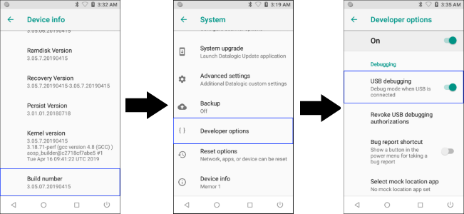

Once you have enabled USB debugging on your device, you are ready to connect your device to DXU.

1. Launch **DXU** on your PC.

2. Connect your device to your PC with a **USB** cable.

3. Click the device’s button in the “**Available Device**” list.

#### Connect to a Device via Network Manually

If DXU Agent on the device has its **“Enable Discovery Manager”**
feature enabled and **DXU** has “**Automatic Discovery of Devices”**
enabled under **Advanced Settings**, then clicking **Refresh** should
display it in the “Available Device” list if it is in the same subnet.

However, if you want to manually add a device in **DXU** make sure both
device and system are in the same subnet and do this:

1. On DXU’s main view, click the “**Add Device**“ button

    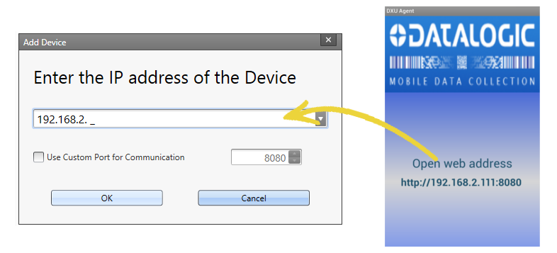

2. In the “Add Device“ dialog, enter the **IP address** of the device
    and optionally its port if it is has been changed from the default;

    2.1. If the port number is not displayed with the IP address in DXU Agent, it can be found by tapping **Menu** > **Settings** > **Advanced Settings** > **Device HTTP server port**.

    Note: you will see the IP Address and port
   details displayed on DXU’s main view along with the model name, serial
   number, and an illustration of the device.

3. Click the **OK** button to complete.

The added device will display on the left side of the console under
**Available Device**.

 Note: you can also directly connect the device
to DXU using USB.

#### Deleting a Device from the Available Device List

Simply click the exit button (**X**) located at top right of the device.


### Command Line

DXU allows for command line execution, such as via a .bat batch file.
This is a convenient method for configuring multiple devices without
having to either launch the UI of DXU desktop or the need to configure
Simplified Deploy. This configuration can happen via USB or over Wi-Fi
(assuming the device has already been attached to the Wi-Fi network).

#### Usage

DXU command line options are described below.

Apply configuration file to any USB connected devices:

```console
DXU –put <filename.dxu>
```

Apply configuration file to device of specific IP address:

```console
DXU –put <filename.dxu> -ip <ipaddress>
```

Apply Simplified Deploy to any USB connected devices:

```console
DXU –man <filename.ini>
```

Apply Simplified Deploy to device of specific IP address:

```console
DXU –man <filename.ini> -ip <ipaddress>
```

To output a log file, add the optional parameter:

```console
DXU -log <logfilename>
```

### Logging

DXU Agent can log its activities. When enabled, logs are written to the
log file location. Logging can be helpful when diagnosing problems, but
at a slight cost of slowing DXU Agent and consuming slightly more power.
This checkbox is not checked by default.

You can specify where DXU Agent’s log file is kept on your Datalogic
mobile computer. The default location on Android OS mobile computers is
/storage/sdcard0, which is located in the device’s on-board flash
memory. This location is a persistent location, so log files stored here
are safe if the mobile computer reboots. If a MicroSD card is used, you
may wish to specify that logs be kept on the card if the card has
greater capacity than on-board flash. MicroSD cards are also persistent.

To enable DXU Agent logging on your Datalogic mobile computer:

1. Resume your mobile computer and unlock its screen.

2. Launch the **DXU Agent** application.

3. Tap the **Menu** button to display the menu.

4. Tap the **Settings** button.

5. Uncheck the “**Enable Service**” checkbox.

    Caution: you must uncheck “Enable Service” before
   you can change any setting in DXU Agent.

6. Check the “**Enable Log**” checkbox.

7. Check the “**Enable Service**” checkbox.

8. Clean up by tapping the **Home** button.

To specify where log files are stored on your Datalogic mobile computer:

1. Resume your mobile computer and unlock its screen.

2. Launch the **DXU Agent** application.

3. Tap the **Menu** button to display the menu.

4. Tap the **Settings** button.

5. Uncheck the “**Enable Service**” checkbox.

    Note: you must uncheck “Enable Service” before
   you can change any setting in DXU Agent.

6. Tap the “**Change Log File Location**” button.

7. Type a valid path on your device into the “Change Log File Location”
    field, and then tap the **OK** button.

8. (Optional, but desired if you wish to log to this new location)
    Check the “**Enable Log**” checkbox.

9. Check the “**Enable Service**” checkbox.

10. Clean up by tapping the **Home** button.

### Security

Configurations and configuration files can require authentication to
open and apply. DXU implements an invisible sort of authentication by
automatically applying a default user name and password to every DXU
configuration and configuration file. You can display an authentication
prompt whenever anyone attempts to connect to one of your Datalogic
mobile computers with DXU, and change both the user name and password as
well to increase security of your devices.

#### Enable Authentication in DXU Agent

You can ensure that users are prompted to enter a user name and password
to open a configuration file in the DXU console or to DXU Agent’s
Settings window on a Datalogic mobile computer. This capability is
enabled with a single checkbox in DXU Agent.

To enable authentication:

1. Resume your mobile computer and unlock its screen.

2. Launch the **DXU Agent** application.

3. Tap the **Menu** button to display the menu.

4. Tap the **Settings** button.

5. Uncheck the “**Enable Service**” checkbox.

    Caution: you must uncheck “Enable Service” before
   you can change any setting in DXU Agent.

6. Check the “**Is Authentication Required**” checkbox.

7. Check the “**Enable Service**” checkbox.

8. Clean up by tapping the **Home** button.

To authenticate while opening DXU Agent’s Settings window:

1. Resume your mobile computer and unlock its screen.

2. Launch the **DXU Agent** application.

3. Tap the **Menu** button to display the menu.

4. Tap the **Settings** button.

5. Type your password into the “**Enter Password**” field, and then tap
    the **OK** button.

    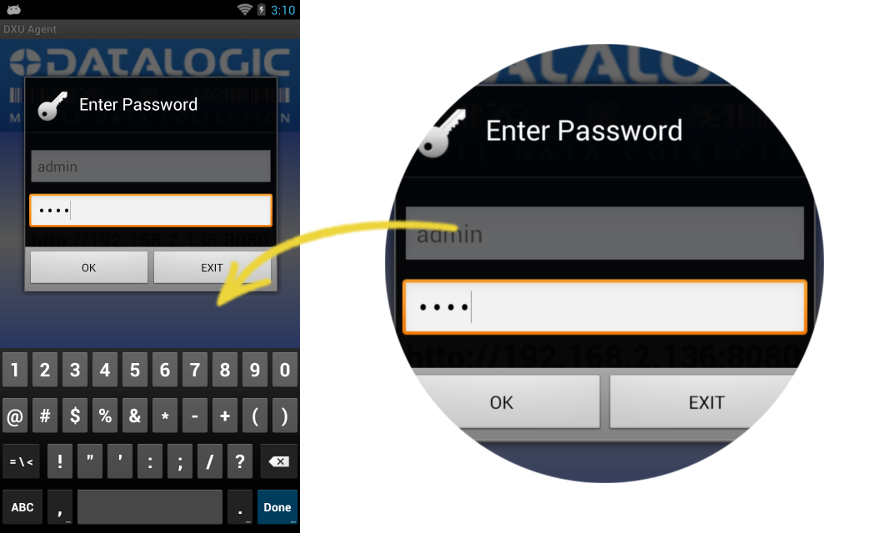

#### Change the User Name in DXU Agent

Editing the user name adds an extra layer of complication to
authentication. The default user name is “admin.” Changing the user name
adds another piece of information that a hacker must enter correctly to
access the configuration in DXU.

To change the User Name:

1. Resume your mobile computer and unlock its screen.

2. Launch the **DXU Agent** application.

3. Tap the **Menu** button to display the menu.

4. Tap the **Settings** button.

5. Uncheck the “**Enable Service**” checkbox.

    Caution: you must uncheck “Enable Service” before
   you can change any setting in DXU Agent.

6. Tap the “**User Name**” button.

7. Delete the contents of the field, and type a new user name.

8. Tap the **OK** button.

9. Check the “**Is Authentication Required**” checkbox.

10. Check the “**Enable Service**” checkbox.

11. Clean up by tapping the **Home** button.

#### Change the Password in DXU Agent

Editing the password ensures the simplest means to keep untrusted actors
out of DXU Agent configuration settings. The default password is “0000.”

To change the Password:

1. Resume your mobile computer and unlock its screen.

2. Launch the **DXU Agent** application.

3. Tap the **Menu** button to display the menu.

4. Tap the **Settings** button.

5. Uncheck the “**Enable Service**” checkbox.

    Note: you must uncheck “Enable Service” before
   you can change any setting in DXU Agent.

6. Tap the **Password** button.

7. Delete the contents of the field, and type a password.

8. Tap the **OK** button.

9. Check the “**Is Authentication Required**” checkbox.

10. Check the “**Enable Service**” checkbox.

11. Clean up by tapping the **Home** button.

### DXU Agent Android

The following describes the Android version of DXU Agent.

The most important thing to remember about changing DXU Agent settings
is that the DXU Agent Service must be disabled before changing settings,
and it must be enabled again after changing settings to put those
settings into operation.

Find these settings in the DXU Agent application on the mobile computer.

1. Launch the DXU Agent application.

2. Tap the Menu button () to display the menu.

3. Tap the Settings button.

   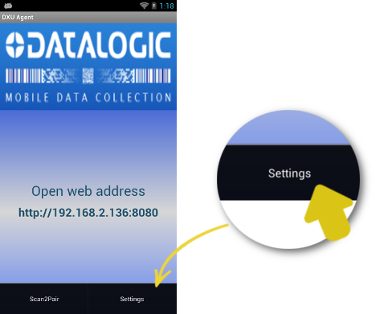

4. Tap the Settings item

#### Settings

Here is a brief overview of each of the settings:

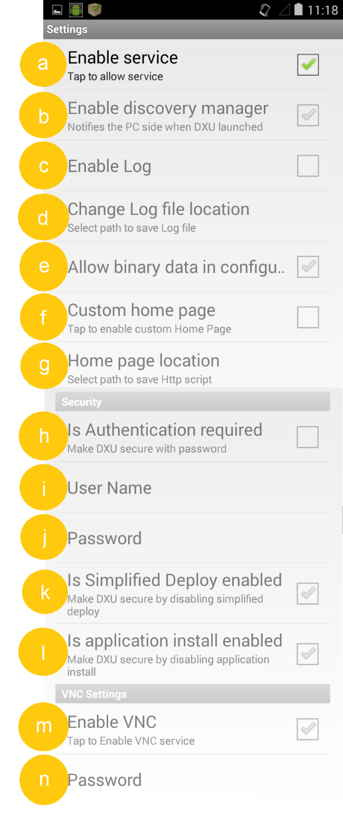

##### a. Enable Service

This checkbox is the key to changing any settings in DXU Agent.
Unchecking this checkbox allows you to edit almost all settings.
Checking this checkbox puts those settings into operation. This checkbox
is checked by default.

Also, if for some reason you want to disable DXU on a mobile computer,
you can uncheck this checkbox to prevent DXU from changing settings.
Doing this will not undo settings changes already made, but it will
prevent DXU from getting the mobile computer’s settings and will prevent
DXU from changing any settings on the mobile computer.

##### b. Enable Discovery Manager

This checkbox controls the mobile computer’s broadcast of its name and
device type over USB or over a network to the DXU desktop application.
When checked, DXU will automatically see when the mobile computer
connects to USB or over a network. When unchecked, DXU will not display
when the mobile computer connects to USB or over the network. This
checkbox is checked by default.

##### c. Enable Log

This checkbox enables DXU Agent’s logging capability. When enabled, logs
are written to the log file location. Logging can be helpful when
diagnosing problems, but at a slight cost of slowing DXU and consuming
slightly more power. This checkbox is not checked by default.

##### d. Change Log File Location

This field allows you to specify where DXU Agent’s log file is kept on
your Datalogic mobile computer. The default location on Android OS
mobile computers is /storage/sdcard0, which is located in the device’s
on-board flash memory. This location is a persistent location, so log
files stored here are safe if the mobile computer reboots. If a MicroSD
card is used, you may wish to specify that logs be kept on the card if
the card has greater capacity than on-board flash. MicroSD cards are
also persistent.

##### e. Allow Binary Data in Configuration

This checkbox allows a few types of binary data to be transmitted from
the Datalogic mobile computer to DXU, and from DXU to the mobile
computer. The desktop wallpaper file is an example of binary data that
can be controlled by DXU. Checking this checkbox allows binary data to
be sent to or from the binary computer in the configuration file.
Unchecking this checkbox blocks transfer of binary data in the
configuration file. Binary data can be quite large compared to other
configuration data, so if performance is important and the desktop
wallpaper file does not need to be changed remotely for example, the
administrator can uncheck this checkbox to make configuration files
smaller and quicker to apply. This checkbox is checked by default.

##### f. Custom Home Page

This checkbox enables a locally hosted web page that can be displayed on
the device when network connectivity fails. Checking this checkbox will
set browsers’ error pages to the home page located in the “Home Page
Location” folder location. Unchecking this checkbox returns browsers to
their default error behavior when they cannot load any particular web
page.

##### g. Home Page Location

This field stores the path to a locally hosted web page that can be
displayed on the device when network connectivity fails. This
functionality is enabled by the “Custom Home Page” checkbox. This folder
can be located in either internal flash (/storage/sdcard0) or in a
MicroSD card (/storage/sdcard1). The default value is /storage/sdcard0.

##### h. Is Authentication Required

This checkbox enables authentication to launch DXU Agent, and puts the
User Name and Password into operation. When enabled, the user must
correctly type both the user name and password to gain access to DXU
Agent’s settings. This checkbox is not checked by default.

Note that these settings are also enforced by the DXU desktop
application when it loads the configuration from the device. The DXU
administrator will be prompted to type this user name and password. Once
authenticated, the DXU administrator can edit the user name and password
in DXU and apply these to devices.

##### i. User Name

This field stores the user name used to log into DXU Agent. It is put
into effect when the “Is Authentication Required” checkbox is checked.
The default value is “admin” and you can change it.

##### j. Password

This field stores the password used to log into DXU Agent. It is put
into effect when the “Is Authentication Required” checkbox is checked.
The default value is “0000” and you can change
it.


##### k. Is Simplified Deploy enabled

This checkbox enables Simplified Deploy. This is a security setting that could be used, for example, to allow use of Simplified Deploy only once as an out-of-box experience.

##### l. Is application install enabled

This checkbox enables installing applications with Simplified Deploy. This is a security setting that can be used to disable the feature of allowing Simplified Deploy to install customer applications onto the device.

##### m. Enable VNC

This checkbox enables VNC, a cross-platform standard for remotely
controlling computers. DXU uses VNC to implement its Remote Control
feature. Unchecking this checkbox blocks DXU from remotely observing and
controlling the device. Checking this checkbox enables this feature.
This checkbox is checked by default.

##### n. VNC Password

This field allows VNC communication to be authenticated, so prying eyes
cannot remotely connect to and control your Datalogic mobile computer.
This field is blank by default.

#### Advanced Settings

These settings must match settings on DXU in order for the DXU desktop
application to communicate with Datalogic mobile computers. A mismatch
will result in a communication failure, which will block all
configuration functionality.

Change these settings only if you understand precisely any advantage you
may gain by doing so. Most users will not realize any advantage from
changing these port settings.

Find these settings in the DXU Agent application on the mobile computer.

To configure DXU Agent’s **Advanced Settings**, do this:

1. Launch the DXU Agent application.

2. Tap the Recent Apps button to display the menu.

3. Tap the “Advanced Settings” button.

As with the DXU Agent settings listed above, these advanced settings can
only be changed when the “Enable Service” checkbox is unchecked.

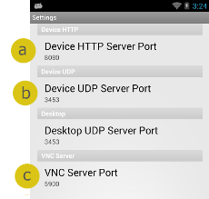

##### a. Device HTTP Server Port

This field configures the HTTP port for the DXU server running on the
device. It is set to TCP port 80 by default, the same as most web
servers.

##### b. Device UDP Server Port

This field configures the UDP port for the DXU server running on the
device. It is set to UDP port 3453 by default.

##### Desktop UDP Server Port

This field configures the UDP port for communicating to the DXU desktop
server. It is set to UDP port 3453 by default.

##### c. VNC Server Port

This field configures the HTTP port for VNC running on the device. It is
set to TCP port 5900 by default, which is the customary port used by
most VNC clients for connections.

#### Version

This page displays the DXU Agent version number.

### DXU Agent Windows CE

DXU Agent for Windows CE can be found in the device's Control Panel.
