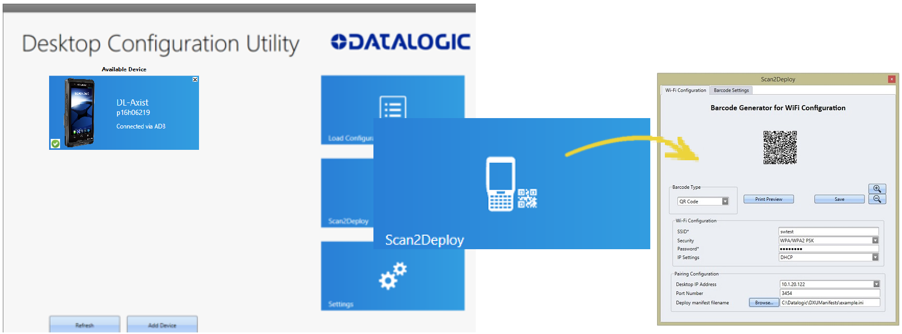
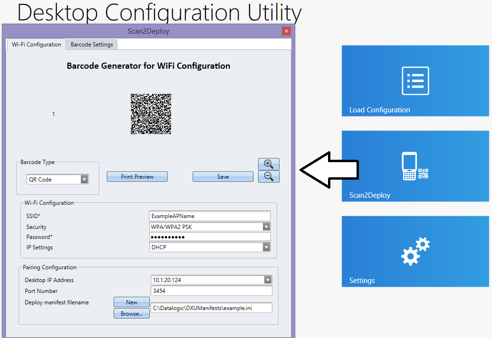
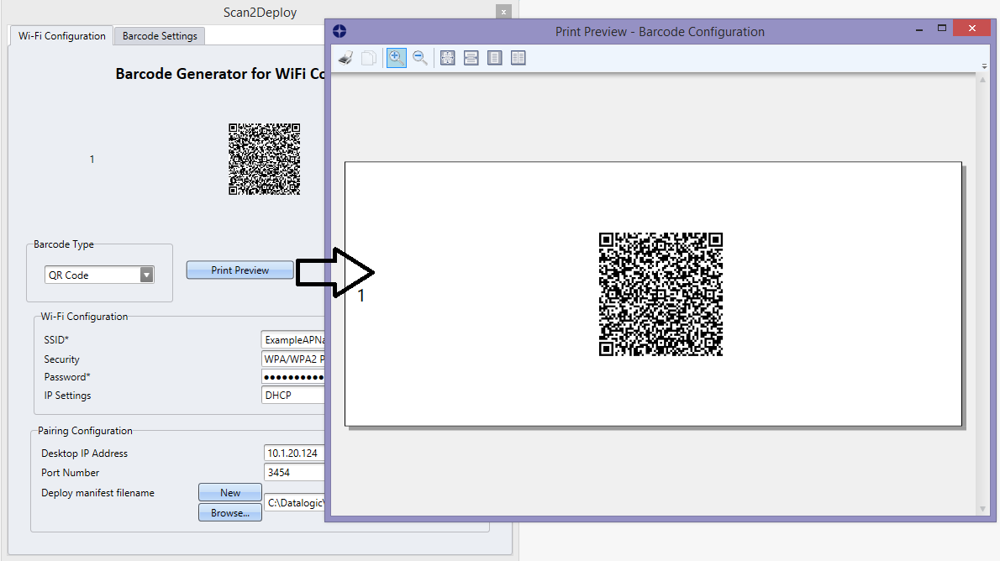
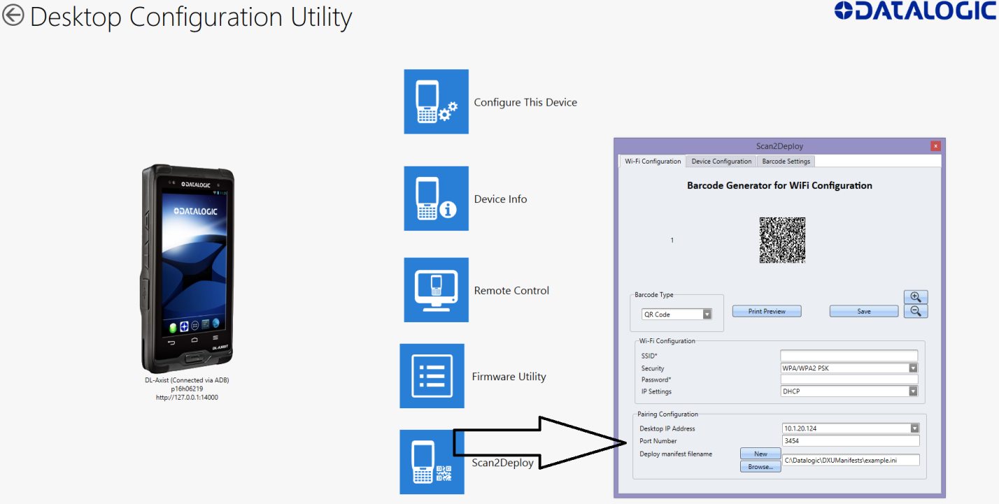
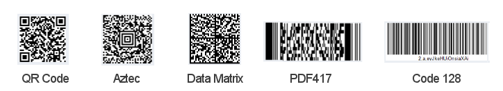
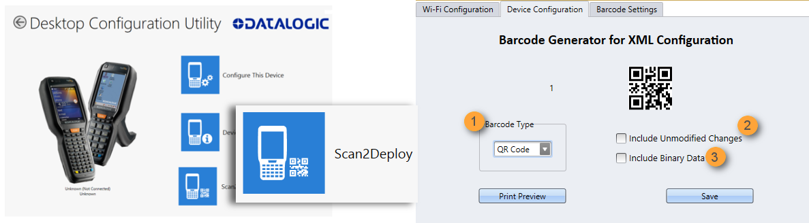

# Version 1.9

## Contents

1. [Audience](#audience)

1. [Conventions](#conventions)

1. [Product Overview](#product-overview)

   1. [DXU Features](#dxu-features)

   1. [How DXU Works](#how-dxu-works)

   1. [Supported Datalogic Mobile Computers](#supported-datalogic-mobile-computers)

1. [Installation](#installation)

   1. [Supported Windows Versions](#supported-windows-versions)

   1. [Unsupported Windows Versions](#unsupported-windows-versions)

   1. [How to Install DXU](#how-to-install-dxu)

1. [Controls](#controls)

   1. [DXU Agent Controls](#dxu-agent-controls)

   1. [DXU Application Controls](#dxu-application-controls)

   1. [Simplified Deploy](#simplified-deploy)

1. [Tasks](#tasks)

   1. [Connect to a devices](#connect-to-devices)

   1. [Configuration Files](#configuration-files)

   1. [Configure DXU](#configure-dxu)

   1. [Enable Logging on the Datalogic Mobile Computer](#enable-logging-on-the-datalogic-mobile-computer)

   1. [Set User Names, Passwords, and Prompt for Authentication on DXU
Configuration Files](#set-user-names-passwords-and-prompt-for-authentication-on-dxu-configuration-files)

   1. [Create Scan2Deploy Labels to Fully Configure Remote Devices](#create-scan2deploy-labels-to-fully-configure-remote-devices)

   1. [View Device Info for a Connected Device](#view-device-info-for-a-connected-device)

   1. [View Device Info Recorded in a Configuration File](#view-device-info-recorded-in-a-configuration-file)

   1. [Remote Control](#remote-control)

   1. [Update Firmware](#update-firmware)

   1. [Configuring SureLock and SureFox](#configuring-surelock-and-surefox)

1. [Command Line DXU Execution](#command-line-dxu-execution)

## Audience

This manual is written for small business owners and corporate
administrators who find using DXU to configure and upgrade Datalogic
mobile computers that run the Android operating system. End users of
Datalogic’s mobile computers can usually change settings on the device
in their hands. Larger corporate administrators will likely resort to
MDM tools that can remotely configure and update large groups of mobile
devices at many sites simultaneously, such as Wavelink Avalanche and
42Gears SureMDM.

## Conventions

Datalogic mobile computers will often be referred to generically as “the
device” in this manual.

Personal computers which run any of a variety of Windows operating
systems will often be referred to as a “PC.”

**Application controls** are highlighted in **boldface** for
convenience.

 Notes are highlighted with this icon for
visibility. These points illustrate ideas to remember.

 Cautions are highlighted with this icon for
visibility. Cautions only point out where a choice may result in a
savings of time or effort.

 Warnings are highlighted with this icon for
visibility. Warnings try to guide you around potential problems that may
result in incorrect functionality, loss or corruption of data, damage to
equipment, or the risk of physical danger.

## Product Overview

### DXU Features

Datalogic DXU is a an utility to configure devices in the following ways:

* **Datalogic Configuration**

* **Firmware Update**

* **Remote Control**

DXU can connect directly to individual Datalogic mobile
computers that connect either directly to a PC via USB or remotely over
a network, either via Ethernet or Wi-Fi. DXU reports information about
currently connected devices.


DXU can configure a wide variety of device parameters, including the
scanner and most decoding parameters, the touch screen and the keyboard,
interfaces such as NFC, Wi-Fi, Bluetooth, USB, and Ethernet, device
settings such as date, time, time zone, and power management, and
security settings such as password access. DXU can also configure
communication parameters between the application that runs on a PC and
the client applications that run on Datalogic mobile computers.

DXU offers a method to print out barcodes that Datalogic0 mobile
computer users can scan to quickly connect to DXU called Scan2Deploy.
DXU also offers the capability to create barcodes that can completely
configure a Datalogic mobile computer by scanning these barcodes alone,
without connecting to DXU via USB or via a network, which may prove
helpful for configuring devices that operate in environments that forbid
the use of networked computers.

DXU offers remote control capabilities for remote troubleshooting. There
are some limitations to this (not too remote), but it allows a DXU
administrator an opportunity to remotely operate a Datalogic mobile
computer to check settings, configure the device using its own user
interface, and to see what a user sees.

### How DXU Works

DXU is really two applications working together. The DXU desktop
application runs on a Windows PC, providing convenient UI to configure
Datalogic mobile computers. An application runs continuously on
Datalogic mobile computers to extract current configuration settings and
send them to the DXU desktop application, and to receive updated
settings from the DXU desktop application and apply those configuration
settings to the mobile computer.


DXU configurations are stored as configuration files on the PC, and are
transmitted to and from the Datalogic mobile computer as XML web pages.
XML is a standard data format that is widely used for a variety of
applications on the internet. Some data is encrypted in the XML file to
protect your sensitive data from prying eyes, but most data which is not
sensitive is transmitted in plain text that can be easily viewed and
analyzed.

DXU can connect directly to devices that are plugged into your PC via
USB, including those inserted into a powered dock which is connected to
your PC via USB. DXU can also connect to devices on your network. DXU
supports connecting only to devices in the same subnet as the PC running
DXU. Datalogic mobile computers connected to Wi-Fi wireless access
points can connect to DXU as long as the AP is on the same subnet as
your PC. Datalogic mobile computers connected over Ethernet can connect
to DXU too as long as they connect on the same subnet as your PC. Ask
your network specialists for more information.

### Supported Datalogic Mobile Computers

DXU supports select Datalogic mobile computers that run Android and Windows CE operating
systems.

#### Supported Android devices:
* Joya Touch A6
* Joya Touch A6 Healthcare
* Skorpio X4
* Falcon X4
* DL-Axist

#### Supported Windows CE devices:
* Skorpio X4
* Falcon X4
* Skorpio X3
* Falcon X3 / X3+

## Installation

The DXU desktop application must be installed on a Windows PC. DXU Agent
is already pre-installed on Datalogic mobile computers.

### Supported Windows Versions
DXU is supported on both 32-bit and 64-bit versions of the following Windows operating systems:

* Windows Vista
* Windows 7
* Windows 8
* Windows 8.1
* Windows 10

### Unsupported Windows Versions

DXU may run on older, unsupported Windows versions, but Datalogic
technical support will not support users who have problems if they
install DXU on Windows versions no longer supported by Microsoft.

### How to Install DXU

1.  Copy the installer file to any convenient location on your PC.

2.  Launch the installer.

3.  If User Access Control (UAC) is enabled on your computer, authorize
    the installer to run. (UAC is enabled by default on all supported
    Windows operating systems, but it can be disabled by default. If you
    do not see this prompt, UAC may have been disabled.)

4.  Follow on-screen prompts to finish installing DXU.

5.  Follow on-screen prompts to finish installing Datalogic Device
    Support drivers.

## Controls

### DXU Agent Controls

The following describes the Android version of DXU Agent. Future
versions of this document will describe the WEC7 DXU Agent Control
Panel.

The most important thing to remember about changing DXU Agent settings
is that the DXU Agent Service must be disabled before changing settings,
and it must be enabled again after changing settings to put those
settings into operation.

Find these settings in the DXU Agent application on the mobile computer.

1.  Launch the DXU Agent application.

2.  Tap the Menu button () to display the menu.

3.  Tap the Settings button.


4.  Tap the Settings item

#### DXU Agent Settings Window

Here is a brief overview of each of the settings:


##### a. Enable Service

This checkbox is the key to changing any settings in DXU Agent.
Unchecking this checkbox allows you to edit almost all settings.
Checking this checkbox puts those settings into operation. This checkbox
is checked by default.

Also, if for some reason you want to disable DXU on a mobile computer,
you can uncheck this checkbox to prevent DXU from changing settings.
Doing this will not undo settings changes already made, but it will
prevent DXU from getting the mobile computer’s settings and will prevent
DXU from changing any settings on the mobile computer.

##### b. Enable Discovery Manager

This checkbox controls the mobile computer’s broadcast of its name and
device type over USB or over a network to the DXU desktop application.
When checked, DXU will automatically see when the mobile computer
connects to USB or over a network. When unchecked, DXU will not display
when the mobile computer connects to USB or over the network. This
checkbox is checked by default.

##### c. Enable Log

This checkbox enables DXU Agent’s logging capability. When enabled, logs
are written to the log file location. Logging can be helpful when
diagnosing problems, but at a slight cost of slowing DXU and consuming
slightly more power. This checkbox is not checked by default.

##### d. Change Log File Location

This field allows you to specify where DXU Agent’s log file is kept on
your Datalogic mobile computer. The default location on Android OS
mobile computers is /storage/sdcard0, which is located in the device’s
on-board flash memory. This location is a persistent location, so log
files stored here are safe if the mobile computer reboots. If a MicroSD
card is used, you may wish to specify that logs be kept on the card if
the card has greater capacity than on-board flash. MicroSD cards are
also persistent.

##### e. Allow Binary Data in Configuration

This checkbox allows a few types of binary data to be transmitted from
the Datalogic mobile computer to DXU, and from DXU to the mobile
computer. The desktop wallpaper file is an example of binary data that
can be controlled by DXU. Checking this checkbox allows binary data to
be sent to or from the binary computer in the configuration file.
Unchecking this checkbox blocks transfer of binary data in the
configuration file. Binary data can be quite large compared to other
configuration data, so if performance is important and the desktop
wallpaper file does not need to be changed remotely for example, the
administrator can uncheck this checkbox to make configuration files
smaller and quicker to apply. This checkbox is checked by default.

##### f. Custom Home Page

This checkbox enables a locally hosted web page that can be displayed on
the device when network connectivity fails. Checking this checkbox will
set browsers’ error pages to the home page located in the “Home Page
Location” folder location. Unchecking this checkbox returns browsers to
their default error behavior when they cannot load any particular web
page.

##### g. Home Page Location

This field stores the path to a locally hosted web page that can be
displayed on the device when network connectivity fails. This
functionality is enabled by the “Custom Home Page” checkbox. This folder
can be located in either internal flash (/storage/sdcard0) or in a
MicroSD card (/storage/sdcard1). The default value is /storage/sdcard0.

##### h. Is Authentication Required

This checkbox enables authentication to launch DXU Agent, and puts the
User Name and Password into operation. When enabled, the user must
correctly type both the user name and password to gain access to DXU
Agent’s settings. This checkbox is not checked by default.

Note that these settings are also enforced by the DXU desktop
application when it loads the configuration from the device. The DXU
administrator will be prompted to type this user name and password. Once
authenticated, the DXU administrator can edit the user name and password
in DXU and apply these to devices.

##### i. User Name

This field stores the user name used to log into DXU Agent. It is put
into effect when the “Is Authentication Required” checkbox is checked.
The default value is “admin” and you can change it.

##### j. Password

This field stores the password used to log into DXU Agent. It is put
into effect when the “Is Authentication Required” checkbox is checked.
The default value is “0000” and you can change
it.


##### k. Is Simplified Deploy enabled

This checkbox enables Simplified Deploy. This is a security setting that could be used, for example, to allow use of Simplified Deploy only once as an out-of-box experience.

##### l. Is application install enabled

This checkbox enables installing applications with Simplified Deploy. This is a security setting that can be used to disable the feature of allowing Simplified Deploy to install customer applications onto the device.

##### m. Enable VNC

This checkbox enables VNC, a cross-platform standard for remotely
controlling computers. DXU uses VNC to implement its Remote Control
feature. Unchecking this checkbox blocks DXU from remotely observing and
controlling the device. Checking this checkbox enables this feature.
This checkbox is checked by default.

##### n. VNC Password

This field allows VNC communication to be authenticated, so prying eyes
cannot remotely connect to and control your Datalogic mobile computer.
This field is blank by default.

#### Advanced Settings

These settings must match settings on DXU in order for the DXU desktop
application to communicate with Datalogic mobile computers. A mismatch
will result in a communication failure, which will block all
configuration functionality.

Change these settings only if you understand precisely any advantage you
may gain by doing so. Most users will not realize any advantage from
changing these port settings.

Find these settings in the DXU Agent application on the mobile computer.

To configure DXU Agent’s **Advanced Settings**, do this:

1.  Launch the DXU Agent application.

2.  Tap the Recent Apps button to display the menu.

3.  Tap the “Advanced Settings” button.

As with the DXU Agent settings listed above, these advanced settings can
only be changed when the “Enable Service” checkbox is unchecked.


##### a. Device HTTP Server Port

This field configures the HTTP port for the DXU server running on the
device. It is set to TCP port 80 by default, the same as most web
servers.

##### b. Device UDP Server Port

This field configures the UDP port for the DXU server running on the
device. It is set to UDP port 3453 by default.

##### Desktop UDP Server Port

This field configures the UDP port for communicating to the DXU desktop
server. It is set to UDP port 3453 by default.

##### c. VNC Server Port

This field configures the HTTP port for VNC running on the device. It is
set to TCP port 5900 by default, which is the customary port used by
most VNC clients for connections.

#### Version

This page displays the DXU Agent version number.

### DXU Application Controls

#### Available Device List and Configuration

The Available Devices list displays devices which are either currently
connected, have been connected since launching DXU, or were manually
connected at some time in the past. You can refresh the view to
automatically show devices or hide devices which connect while you work
on another device. In general, they should appear automatically as they
connect.


By default, “No Devices Available” will display when no devices announce
themselves to DXU either when they connect via USB or when they connect
over a network. Simply connecting a Datalogic mobile computer to a
network, even on the same subnet as the PC running DXU, will not
automatically display as being available. The device must try to connect
to DXU, which sends an announcement packet to DXU. This can be done by
scanning Scan2Deploy barcode labels. However, connecting a device to the
PC running DXU via USB will automatically display it in DXU. You may
also check the “Enable Automatic Discovery of Devices” checkbox in DXU’s
Settings view to automatically see any device that connects to the
network, but remember that automatic discovery is restricted to
discovering devices only within your PC’s subnet.

To configure a connected device, you simply click its button under
Available Devices to load its configuration into DXU.

To return to the DXU main window, click the Back button (generally, a
leftward pointing arrow in a circle).


##### Refresh

This button manually refreshes the display of currently connected
devices. This can overcome problems with the automatic display of
devices as they connect, and it can remove devices from the list that
are not currently connected.


##### Add Device

This button opens the “Add Device” dialog which allows you to type the
IP address of a device. This dialog does not support DNS naming of
devices. You can also use a custom TCP port if you have configured your
device to use one in DXU Agent. For convenience, this field
pre-populates with your PC’s IP subnet. You need only type in the last
number of your device’s IP address if it is in the same subnet as your
PC.


This dialog allows you to manually connect to devices running DXU Agent
that are either inside your PC’s subnet or outside it. The limitation is
that devices on other subnets must be on a subnet that is routable from
your PC’s subnet. Consult with your network expert for more information.

Once connected, devices that respond to DXU’s query over the network
will display in the Available Devices list.

#### Load Configuration

Clicking the “Load Configuration” button opens a standard file dialog
that allows you to explore for and select a DXU configuration file.
Loading a configuration allows you to edit a device’s configuration when
the device is not connected to DXU. This also allows you to save copies
of this configuration to new locations or file names, so you can edit a
copy of the configuration while leaving the original configuration
unchanged.


To load a configuration:

1.  Click the “Load Configuration” button.

2.  Explore to any folder where DXU configuration files are located,
    then select any configuration file you wish. You can double-click it
    to streamline opening it.

3.  Click the Open button.

Note that the default location is your user directory on your PC, but
DXU remembers the last directory you opened a DXU configuration file,
and always starts in that directory the next time you wish to open
another DXU configuration file.

## Simplified Deploy

### Overview

DXU desktop can be configured to enable the Datalogic out-of-box
experience Simplified Deploy, using either Scan2Deploy and/or Tag2Deploy
(on NFC enabled devices). With Simplified Deploy you can automatically
connect your device to the network and provision it. The Scan2Deploy
button on DXU desktop can be used to print barcodes that allow factory
reset (Android) or Clean Boot (WEC7) devices to automatically connect to
Wi-Fi, update their firmware, configure the device, and install
applications.

In order for Simplified Deploy to function:

  - The PC where DXU desktop is installed must be accessible from the
    Wi-Fi network.

  - There must be a Manifest File, a text file located in the folder
    C:\\Datalogic\\DXUManifests.

  - Using the Scan2Deploy button on DXU desktop, a Simplified Deploy
    barcode must be generated and printed.

### Manifest File

Manifest Files are text .ini files which indicate which firmware
versions to update devices to (\[update\] tag), which DXU configuration
file to apply (\[config\] tag), and which .apk (Android) and .cab (WEC7)
file applications to install (\[install\] tag). It is recommended that
\[update\] tags be in separate manifest files. You can specify more than
one DXU configuration file too apply and more than one application to
install.

Additionally, you can have more than one active manifest files on the PC
where DXU desktop is installed, each with its’ own Simplified Deploy
Barcode to be used by Scan2Deploy utility on the device. In this way you
can easily have devices provisioned for different tasks.

By default firmware, configuration files, and applications are assumed
to reside in the C:\\Datalogic\\DXUManifests folder. If they don’t then
the Manifest File entry must specify the path.

**Manifest file format:**
```
[update]

<name of firmware file with full path on DXU Server PC\>

[install]

<name of app1 to install file with full path on DXU Server PC>

<name of app2 to install file with full path on DXU Server PC>

...

<name of appN to install file with full path on DXU Server PC>

[config]

<name of DXU configuration file file with full path on DXU Server PC>

```

**Android Example**
```
[update]

firmware.zip

[install]

install.apk

C:\\Users\\DLUser\\Documents\\Android\\my\_terminal.apk

[config]

defaultConfigAndroid.dxu

C:\\Users\\DLUser\\Documents\\Android\\my\_user.dxu
```

### Scan2Deploy

Scan2Deploy allows a Datalogic mobile computer running DXU Agent to
connect using DXU Agent’s Scan2Deploy functionality by scanning a
barcode. There are two different Scan2Deploy buttons in DXU, and they
have different intentions and different scopes of functionality.



The **Scan2Deploy** button located on the main DXU page does not require
an active connection to a device to create a “Scan2Deploy” barcode
label. This button opens the Scan2Deploy dialog streamlined to create
“Scan2Deploy” labels that can automatically connect a device to a
Wi-Fi access point on your PC’s subnet and to automatically connect it
to DXU, adding it to DXU’s “**Available Device**” list.

### Printing a Simplified Deploy Barcode

By embedding the IP address of the PC where DXU desktop is installed,
security information for accessing the Wi-Fi network, and name of the
desired Manifest File, an encrypted barcode can be printed for use by
Scan2Deploy on the device.

To print this barcode, from DXU desktop:

1.  Launch Scan2Deploy.



2.  Enter in the Wi-Fi Configuration information so that the device can
    connect to the network, including SSID and password.

3.  Enter the Pairing Configuration, including the IP Address of the PC
    which has DXU desktop installed, and the name of the manifest file
    to be used. You can also create a New manifest file as a template
    for either DXU configuration file or a firmware update file. You
    could then edit the Manifest File .ini file in a text editor, like
    Word Pad, to add applications to install.

4.  Press the Print Preview Button, enlarging the barcode view as
    needed. And then printing by pressing the upper left hand printer
    button.



### Printing Custom Configuration Barcodes

Outside of Simplified Deploy, the **Scan2Deploy** button located in a
device’s “**Datalogic Configuration Utility**” view can also
automatically connect devices to Wi-Fi access points and to DXU, but
this dialog also has another tab which controls the ability to include
configuration data in the printed barcodes. This version of Scan2Deploy
can fully deploy a device configuration to devices which do not have
network access to DXU on your PC. When the “Include Unmodified Changes”
checkbox is checked all configuration items will be included in the
barcode set. This option results in several barcodes being generated as
true **Scan2Deploy** labels. After scanning the first label in this set,
**DXU Agent’s Scan2Deploy** window on your Datalogic mobile computer
will display how many barcode labels must be scanned, and will display
your progress in scanning them all. Once they are all scanned, DXU Agent
will apply the configuration changes automatically, as if you had
connected to DXU to transfer the changes.

While it is possible to generate a Simplified Deploy barcode using this
dialog, it has the additional flexibility presented in the Device
Configuration tab, which will allow printing barcodes to configure the
device without the need of the PC with DXU desktop being accessible from
the Wi-Fi network.



#### Wi-Fi Configuration Tab

##### Barcode Type Menu

The “Barcode Type” menu allows you to choose which barcode symbology
that Scan2Deploy labels will be printed in. Each barcode symbology has
advantages and disadvantages which may benefit your organization.



QR Code, Aztec Code, and Data Matrix are 2D barcodes that offer high
data density and larger capacity, but require 2D scanners to scan them.
PDF417 is a stacked linear barcode that offers moderate data density and
larger capacity than linear symbologies. Code 128 is a linear symbology
that can be scanned by laser scanners, but its data capacity is low,
which may result in a great many individual labels to be scanned in
order to fully configure a mobile computer remotely.

##### Print Preview

The Wi-Fi Configuration tab offers a live preview of the barcode as you
select the barcode type and enter data into the dialog’s fields.

##### Save Button

You may save Scan2Deploy labels as graphic files, should this prove
convenient for including Scan2Deploy barcodes in an e-mail to a remote
office, for example.

##### Wi-Fi Configuration Controls

As with the other version of the Scan2Deploy dialog, this group of
controls allows you to configure the automatic configuration of a
device’s Wi-Fi connection. Fields allow you to enter the SSID,
password, security method, and IP settings. If you select “Static” in
the “IP Settings” menu, additional field will appear allowing you to
configure a static IP address for the device that will scan these
Scan2Deploy barcodes.

 Warning: if you configure Scan2Deploy labels
with a static IP address, do not have two different devices scan the
same label set, or an IP conflict will result. Consult your network
expert for more information.

##### Pairing Configuration Controls

These fields let you configure your connection to the PC you are running
DXU on. These fields are filled in automatically, but you can change
them to deliberately connect to another IP address where another
instance of DXU is running, for example.

#### Barcode Settings

As with the other version of the Scan2Deploy dialog, this tab lets you
set the maximum size of each label by symbology. For example, if you
know that your devices can scan larger 2D labels than DXU’s default
setting, you can increase the size of your label so fewer labels are
needed to fully deploy your configuration.

#### Settings View

The **Settings** view is opened by clicking the Settings button on DXU’s
main view. This view includes controls which should seldom need to be
changed, such as the language that DXU displays in, TCP ports used to
communicate with remote devices, and the About tab that displays DXU’s
version.


##### Language Tab

The **Language** tab lets you switch the language that strings in DXU
are displayed in. The default language is US English, but you may choose
Italian, Chinese Simplified, or Chinese Traditional. Additional
languages may be added later without notice.

##### Advanced Settings Tab

The “Advanced Settings” tab lets you change network communications
settings that DXU uses to communicate several types of information with
remote computers that are being configured.


###### Desktop UDP Service Port

The “Desktop UDP Server Port” filed must be set to the same value as the
matching ports on the remote device to ensure communication and remote
configuration.

###### Device UDP Service Port

The “Desktop UDP Server Port” field must be set to the same value as the
matching ports on the remote device to ensure communication and remote
configuration.

###### Device HttpServer Port

The “Device HTTP Server Port” field must be set to the same value as the
matching ports on the remote device to ensure communication and remote
configuration.

###### Device VNC Server Port

The “Device VNC Server Port” field must be set to the same value as the
matching ports on the remote device to enable Remote Control.

###### Enable Proxy

The “Enable Proxy” setting, if checked, will use your PC’s global proxy
settings to connect to external IP addresses.

###### (Beta) Enable USBLAN Proxy

This feature is currently released in Beta form. It allows you to
connect X4 and X3 generation CE devices running in USBLAN mode to a PC
running DXU via USB cable and access HTTP servers located on the
attached network (LAN or Internet). The following limitations are
present:

  - The PC must not have any other services using UDP port 53

  - The PC must not have any other services using TCP port 80

  - HTTPS connections are not supported

  - No feedback is provided if UDP port 53 or TCP port 80 is already in
    use on your system. It is recommended that you use the resmon.exe
    tool built into Windows to determine if other processes are using
    these ports before using this feature.

##### About Tab

The About tab displays DXU’s version. This is likely the first question
that Datalogic technical support may ask you if you call in with a
question.

#### Desktop Configuration Utility View

This is the view you see when you click on a device’s button in the
“Available Device” list. It displays a large picture of your device’s
model, along with the model name and serial number.

##### Configure this Device Button

This button lets you configure individual parameter values on your
device from DXU. The types of settings include scanner settings,
enterprise settings, system configuration settings, DXU Agent
configuration settings, Soft Spot settings, Tap2Deploy device-side
settings, and SureLock settings. Other settings may be added in the
future. Additional settings may be available depending on hardware
options installed on your Datalogic mobile computer, and may depend on
software installed on your mobile computer.

##### Device Info Button

Clicking this button displays the Device Info view, which displays your
device’s Wi-Fi radio capabilities, the type of barcode scanner on the
device, the operating system version, battery information, the firmware
version installed on your device, and the version of the enterprise SDK,
which may be important for troubleshooting.


##### Remote Control Button

Clicking this button opens a Remote Control window that displays what is
visible on the screen of the device you are currently connected to. This
window also includes buttons to remotely activate the devices external
buttons, and to capture a screen shot of what is visible on its screen.

##### Firmware Update Utility Button

Clicking this button opens the “Firmware Utility” dialog, which you can
use to update the firmware on your device.


##### Scan2Deploy Button

Clicking this button opens the Scan2Deploy button. See *Printing
Customer Configuration Barcodes*, above. The version of the Scan2Deploy
dialog opened from within the “Desktop Configuration Utility” view lets
you create Scan2Deploy barcode sets that can fully configure a device
without network access to DXU on your PC, containing all configuration
settings in one set of barcodes and applying them by scanning the labels
– all without needing to use Simplified Deploy.

## Tasks

### Connect to devices
#### Connect to a Device via USB

You can connect to a Datalogic mobile computer directly by connecting it
to your PC with a USB cable. DXU will connect to it directly without any
further set-up.

1.  Launch **DXU**.

2.  Connect your device to your PC with a **USB** cable.

3.  Click the device’s button in the “**Available Device**” list.

#### Connect to a Device via Network Manually

If DXU Agent on the device has its **“Enable Discovery Manager”**
feature enabled and **DXU** has “**Automatic Discovery of Devices”**
enabled under **Advanced Settings**, then clicking **Refresh** should
display it in the “Available Device” list if it is in the same subnet.

However, if you want to manually add a device in **DXU** make sure both
device and system are in the same subnet and do this:

1.  On DXU’s main view, click the “**Add Device**“ button;
    
    

2.  In the “Add Device“ dialog, enter the **IP address** of the device
    and optionally its port if it is has been changed from the default;

 Note: you will see the IP Address and port
details displayed on DXU’s main view along with the model name, serial
number, and an illustration of the device.

3.  Click the **OK** button to complete.

The added device will display on the left side of the console under
**Available Device**.

 Note: you can also directly connect the device
to DXU using USB.

#### Connect to a Device via Network Using Scan2Deploy

These steps assume you already have your network set up, and you already
have your printer set up. To connect a device to a Wi-Fi access point
and to DXU using default settings, do this:

1.  Launch **DXU**.

2.  Click the **Scan2Deploy** button on DXU’s main view.

3.  Enter the **SSID** and **Password** for the Wi-Fi access point that
    your Datalogic mobile computer will use to connect to your network.

 Note: in most cases you should be able to
leave other fields with their default values. You may, of course, change
those values as needed to work with your network setup.

4.  Click the “**Print Preview**” button.

5.  Click the **Print** button in the button bar.

6. Since Print dialogs vary by the model or your printer, configure the
    print job and print as you normally do. Clean up by closing these
    dialogs.

7. Resume the device and unlock its screen.

8. Launch the DXU Agent application.

9. Tap the **Menu** button, and then select the **Scan2Deploy**
    command.

10. Scan the barcode.

Your device should appear in DXU’s main window in the “Available Device”
list. Click that button to continue configuring your device.

#### Deleting a Device from the Available Device List

Simply click the exit button (**X**) located at top right of the device.


### Configuration Files

DXU configuration files end with the \*.dxu file extension. They are XML
files that can contain binary data for some configuration items like
wallpaper images.

#### Save a Configuration File

To save a configuration file, do this:

1.  From within the “Device Configuration” view, click the “**Save As**”
    button.


2.  You may type the path and file name in the field, or you can click
    the **Browse** button to use a stand file dialog to explore to the
    folder of your choice and type the file name. Unusually, clicking
    the Save button in the Save As dialog does not actually save the
    configuration file yet, but instead returns you to the “**Save
    Configuration**” dialog.

3.  *Optionally*, you may check the “**Use Password**” checkbox and type
    a password into the field. This will obligate anyone who opens this
    configuration file in the future to correctly type the password in
    order to open the file.

4.  Click the **Save** button.

5.  Click the **OK** button to dismiss the confirmation dialog.

#### Open a Configuration File

To load a configuration file saved earlier, do this:

1.  Launch DXU.

2. Click the “**Load Configuration**” file. This will open a standard
    file dialog.

3. Explore to your configuration file, select it, and click the
    **Open** button.


#### Open a Configuration File Which is Authenticated

DXU will display a login prompt when you open a configuration file that
requires authentication. DXU will also display a login prompt when
connecting to a device with a password set in DXU Agent.


To open a configuration or connect to a device which requires
authentication:

1.  Open a configuration file or load the configuration from a connected
    device.

2.  Type the user name for this configuration or device into the “**User
    Name**” field.

3.  Type the password for this configuration or device into the
    **Password** field.

4.  Click the **OK** button.

#### Edit a Configuration File Off-line

You can edit configuration files even when the device they were drawn
from are not connected to DXU. Do this:

1.  Open your configuration file.

2. Edit any settings you wish.

3. Either save the result to a new configuration file, or just save to
    the same configuration file.

#### Add Comments to Configuration Settings

Comments can be added to any tab, node, or parameter in the “Device
Configuration” view. Comments are indicated with a small text balloon
icon.


To add a comment:

1.  Open a configuration file or load the configuration from a connected
    device.

2. Click the “**Configure This Device**” button.

3. Right-click on any tab, node, or parameter, then select the “**Add
    comment**” command in the context-sensitive menu.

4. Type your comment.

5. Click the **OK** button to save. A small text balloon will appear
    next to the item you commented on.

To edit a comment:

1.  Right-click on any item with a small comment icon.

2.  Select the “**Edit comment**” command in the context-sensitive menu.

3.  Edit your comment.

4.  Click the **OK** button to save.

#### Show Comments

You can show all comments in a configuration file in one handy table by
doing this:

1.  Open a configuration file or load the configuration from a connected
    device.

2. Click the “**Configure This Device**” button.

3. If do not have comments in this configuration file, add several.

4. Click the “**Show Comments**” button in the button bar.

You can select and edit comments in this table by double-clicking on the
Comment field. Simply click the exit button (**X**) to close the dialog.

### Configure a Device On-line

Once you have added the device to **Desktop Configuration Utility**, you
can click on the listed device under **Available devices** and use
**Configure This Device** option to start configuring the device. There
is also an option to add comments on all the listed settings.


To configure a device that is directly connected via USB:

1.  Launch DXU.

2.  Connect your Datalogic mobile computer to your PC via a USB cable.

3.  Click the button for your connected device in the “Available Device”
    list.

4. Click the “Configure This Device” button.

5. Configure any settings you wish.

6. Save changes to a configuration file of you do not wish to apply
    them to your device.

7. Apply the configuration changes to your device is this is what you
    want to do.

To configure a device that is connected over the network (either
Ethernet or Wi-Fi):

1.  Launch DXU.

2.  Connect your Datalogic mobile computer to DXU manually, using
    Scan2Deploy labels, or using automatic discovery. (See instructions
    for these methods in this section.)

3.  Click the button for your connected device in the “Available Device”
    list.

4. Click the “Configure This Device” button.

5. Configure any settings you wish.

6. Save changes to a configuration file of you do not wish to apply
    them to your device.

7. Apply the configuration changes to your device is this is what you
    want to do.

### Configure a Device Off-line via Scan2Deploy

DXU’s **Desktop Configuration Utility** view allows you to generate a
**Scan2Deploy** barcode set for device configuration. The device
settings modified using the console can be saved and printed, which can
then be simply scanned by a remote user of a device to configure it.



The **Device Configuration** tab also has following additional options:

1.  **Barcode Type:** select the barcode symbology used to print the
    Scan2Deploy labels. Different symbologies have advantages and
    disadvantages, so DXU gives you choice.
    
    

2. **Include Unmodified Changes**: when you configure a device using
    the console, you don’t always wish to configure all settings, so by
    default the generated codes for configuration do not include
    unmodified settings. However, once checked the “**Include Unmodified
    Changes**” option allows you to also include unmodified changes in
    the barcode set, letting you fully configure a remote device even
    when it does not have network access to your DXU console computer.

3. **Include Binary Data**: DXU configuration files can contain some
    data in binary formats, like wallpaper images. The “**Include Binary
    Data**” option allows you to include all binary data in the barcode
    set. Note that excluding binary data can significantly reduce the
    size of your configuration file, and also the number of barcode
    labels in a set used to convey that configuration when printed as a
    **Scan2Deploy** label set.

To create a **Scan2Deploy** label set:

1.  Open a configuration file or load the configuration from a connected
    device.

2. Click the “**Configure This Device**” button.

3. Configure any settings you wish.

4. (Optional) **Save** your configuration.

5. Click the **Back** button to return to the **Desktop Configuration
    Utility** view.

6. Click the “**Scan2Deploy**” button.

7. Click the “**Device Configuration**” tab.

8. (Optional) Check the “**Include Unmodified Changes**” checkbox to
    include all configuration settings in your Scan2Deploy barcodes.

9. (Optional) Check the “**Include Binary Data**” checkbox to include
    binary data like the desktop wallpaper image in the configuration
    barcodes.

 Note: this option will increase the number of
barcode labels in the Scan2Deploy label set.

10. (Optional) Select the barcode symbology in the “**Barcode Type**”
    menu.

11. Click the **Save** button to save your barcode label set as a
    graphic image file.

12. To print, click the “**Print Preview**” button, then click the
    **Print** button in the button bar, and then finish printing using
    your printer’s Print dialog.

To apply the configuration by scanning the **Scan2Deploy** barcodes:

13. Resume your Datalogic mobile computer and unlock its screen.

14. Launch the **DXU Agent** application.

15. Tap the **Menu** button, and then select the **Scan2Deploy**
    command.

16. Scan any label in your Scan2Deploy label set.

 Note: some configurations are small enough to
fit on only one barcode label, and others may have many barcodes to
scan.

17. Continue to scan all barcodes until all of them on the list on the
    screen indicate they have been scanned. Once the last label is
    scanned, the configuration will be put into effect, and an on-screen
    notification will confirm that your configuration is complete.

18. Clean up by tapping the **Home** button.

### Configure DXU

There are many ways to configure DXU, such as changing its language,
changing the TCP/IP ports used to communicate with DXU Agent on remote
devices, enabling automatic discovery of devices, enabling logging, and
resetting DXU’s settings back to their default values.

#### Configure DXU’s Language

DXU can display its controls in several languages. US English is the
default, but you can also select Italian, Chinese Simplified or Chinese
Traditional.

To change DXU’s language:

1.  In DXU’s main view, click the **Settings** button.
    
    

2.  Select the language you prefer in the **Language** menu.

3.  Click the **Back** button (a leftward pointing arrow in a circle) to
    return to DXU’s main view.

#### Configure DXU Communication Settings

You can configure the TCP/IP ports used by DXU to communicate with DXU
Agent on Datalogic mobile computers. Configure these settings only if
you understand how these changes affect your network. Consult your
network expert for more information.

To configure DXU’s UDP and TCP ports:

1.  In DXU’s main view, click the **Settings** button.

2.  Click the “**Advanced Settings**” tab.
    
    

3.  Edit the port values to match the ports used by **DXU Agent** on
    your devices:

4. The “Desktop UDP Server Port” configures the UDP port for the DXU
    server running on the on the console PC. It is set to UDP port 3453
    by default.

5. The “Device UDP Server Port” configures the UDP port for the DXU
    Agent server running on the device. It is set to UDP port 3453 by
    default.

6. The “Device HTTP Server Port” configures the TCP port for the DXU
    Agent server running on the device. It is set to TCP port 80 by
    default, like common web servers.

7. The “Device VNC Server Port” configures the TCP port for VNC running
    on the device. It is set to TCP port 5900, like common VNC servers.

8.  Click the **Back** button (a leftward pointing arrow in a circle) to
    return to DXU’s main view).

#### Enable Automatic Discovery of Devices

You can enable the automatic discovery of Datalogic mobile computers by
DXU. This is not enabled by default.

 Warning: do not enable automatic discovery if
you have more than one user of DXU console in your subnet, or you risk
having two DXU administrators changing the settings on any particular
device in your subnet at once. DXU will warn you if it launches and
detects another instance of DXU already running in your subnet.

To enable automatic discovery of devices:

1.  In DXU’s main view, click the **Settings** button.

2.  Click the “**Advanced Settings**” tab.

3.  Check the “**Enable Automatic Discovery of Devices**” checkbox.

4.  Click the **Back** button (a leftward pointing arrow in a circle) to
    return to DXU’s main view).

#### Enable Logging on the DXU Console PC

DXU can log its activities, and this can be very helpful for technical
support to help you diagnose those unexpected problems that always seem
to pop up after software is released to actual users. Logging is not
enabled by default. DXU’s default log file location, once enabled, is in
your user directory at “C:\\Users\\\<user\>\\AppData\\Roaming\\Datalogic
DXU”.

To enable logging:

1.  In DXU’s main view, click the **Settings** button.

2.  Click the “**Advanced Settings**” tab.
    
    

3.  Check the “**Enable Logging**” checkbox.

4. Click the **Back** button (a leftward pointing arrow in a circle) to
    return to DXU’s main view).

#### Reset Advanced Settings to Defaults

You can reset DXU’s Advanced Settings to their default values. To do
this:

1.  In DXU’s main view, click the **Settings** button.

2. Click the “**Advanced Settings**” tab.

3. Click the “**Reset Advanced Settings**” button.

4. Click the **Yes** button to confirm.

5. Click the **Back** button (a leftward pointing arrow in a circle) to
    return to DXU’s main view).

### Enable Logging on the Datalogic Mobile Computer

DXU Agent can log its activities. When enabled, logs are written to the
log file location. Logging can be helpful when diagnosing problems, but
at a slight cost of slowing DXU Agent and consuming slightly more power.
This checkbox is not checked by default.

You can specify where DXU Agent’s log file is kept on your Datalogic
mobile computer. The default location on Android OS mobile computers is
/storage/sdcard0, which is located in the device’s on-board flash
memory. This location is a persistent location, so log files stored here
are safe if the mobile computer reboots. If a MicroSD card is used, you
may wish to specify that logs be kept on the card if the card has
greater capacity than on-board flash. MicroSD cards are also persistent.

To enable DXU Agent logging on your Datalogic mobile computer:

1.  Resume your mobile computer and unlock its screen.

2.  Launch the **DXU Agent** application.

3. Tap the **Menu** button to display the menu.

4. Tap the **Settings** button.

5. Uncheck the “**Enable Service**” checkbox.

 Note: you must uncheck “Enable Service” before
you can change any setting in DXU Agent.

6. Check the “**Enable Log**” checkbox.

7. Check the “**Enable Service**” checkbox.

8. Clean up by tapping the **Home** button.

To specify where log files are stored on your Datalogic mobile computer:

1.  Resume your mobile computer and unlock its screen.

2.  Launch the **DXU Agent** application.

3. Tap the **Menu** button to display the menu.

4. Tap the **Settings** button.

5. Uncheck the “**Enable Service**” checkbox.

 Note: you must uncheck “Enable Service” before
you can change any setting in DXU Agent.

6. Tap the “**Change Log File Location**” button.

7. Type a valid path on your device into the “Change Log File Location”
    field, and then tap the **OK** button.

8. (Optional, but desired if you wish to log to this new location)
    Check the “**Enable Log**” checkbox.

9. Check the “**Enable Service**” checkbox.

10. Clean up by tapping the **Home**
button.

### Set User Names, Passwords, and Prompt for Authentication on DXU Configuration Files

Configurations and configuration files can require authentication to
open and apply. DXU implements an invisible sort of authentication by
automatically applying a default user name and password to every DXU
configuration and configuration file. You can display an authentication
prompt whenever anyone attempts to connect to one of your Datalogic
mobile computers with DXU, and change both the user name and password as
well to increase security of your devices.

#### Enable Authentication in DXU Agent

You can ensure that users are prompted to enter a user name and password
to open a configuration file in the DXU console or to DXU Agent’s
Settings window on a Datalogic mobile computer. This capability is
enabled with a single checkbox in DXU Agent.

To enable authentication:

1.  Resume your mobile computer and unlock its screen.

2.  Launch the **DXU Agent** application.

3. Tap the **Menu** button to display the menu.

4. Tap the **Settings** button.

5. Uncheck the “**Enable Service**” checkbox.

 Note: you must uncheck “Enable Service” before
you can change any setting in DXU Agent.

6. Check the “**Is Authentication Required**” checkbox.

7. Check the “**Enable Service**” checkbox.

8. Clean up by tapping the **Home** button.

To authenticate while opening DXU Agent’s Settings window:

1.  Resume your mobile computer and unlock its screen.

2.  Launch the **DXU Agent** application.

3. Tap the **Menu** button to display the menu.

4. Tap the **Settings** button.

5. Type your password into the “**Enter Password**” field, and then tap
    the **OK** button.
    
    

#### Change the User Name in DXU Agent

Editing the user name adds an extra layer of complication to
authentication. The default user name is “admin.” Changing the user name
adds another piece of information that a hacker must enter correctly to
access the configuration in DXU.

To change the User Name:

1.  Resume your mobile computer and unlock its screen.

2.  Launch the **DXU Agent** application.

3. Tap the **Menu** button to display the menu.

4. Tap the **Settings** button.

5. Uncheck the “**Enable Service**” checkbox.

 Note: you must uncheck “Enable Service” before
you can change any setting in DXU Agent.

6. Tap the “**User Name**” button.

7. Delete the contents of the field, and type a new user name.

8. Tap the **OK** button.

9. Check the “**Is Authentication Required**” checkbox.

10. Check the “**Enable Service**” checkbox.

11. Clean up by tapping the **Home** button.

#### Change the Password in DXU Agent

Editing the password ensures the simplest means to keep untrusted actors
out of DXU Agent configuration settings. The default password is “0000.”

To change the Password:

1.  Resume your mobile computer and unlock its screen.

2.  Launch the **DXU Agent** application.

3. Tap the **Menu** button to display the menu.

4. Tap the **Settings** button.

5. Uncheck the “**Enable Service**” checkbox.

 Note: you must uncheck “Enable Service” before
you can change any setting in DXU Agent.

6. Tap the **Password** button.

7. Delete the contents of the field, and type a password.

8. Tap the **OK** button.

9. Check the “**Is Authentication Required**” checkbox.

10. Check the “**Enable Service**” checkbox.

11. Clean up by tapping the **Home** button.

### Create Scan2Deploy Labels to Fully Configure Remote Devices

The **Scan2Deploy** button located in a device’s “**Datalogic
Configuration Utility**” view can automatically connect devices to Wi-Fi
access points and to DXU, but this dialog also has another tab which
allows you to include configuration data in the printed barcodes. This
version of Scan2Deploy can fully deploy a device configuration to
devices which do not have network access to DXU on your PC. When the
“**Include Unmodified Changes**” checkbox is checked all configuration
items will be included in the barcode set. This option results in
several barcodes being generated as true **Scan2Deploy** labels. After
scanning the first label in this set, **DXU Agent’s Scan2Deploy** window
on your Datalogic mobile computer will display how many barcode labels
must be scanned, and will display your progress in scanning them all.
Once they are all scanned, DXU Agent will apply the configuration
changes automatically, as if you had connected to DXU to transfer the
changes.


To create **Scan2Deploy** barcodes that can completely configure your
device:

1.  Open a configuration file or load the configuration from a connected
    device.

2. Click the “**Configure This Device**” button.

3. Configure any settings you wish.

4. (Optional) **Save** your configuration.

5. Click the **Back** button to return to the **Desktop Configuration
     Utility** view.

6. Click the “**Scan2Deploy**” button.

7. Click the “**Device Configuration**” tab.

8. (Optional) Check the “**Include Unmodified Changes**” checkbox (2)
     to include all configuration settings in your Scan2Deploy barcodes.

 Note: this option will increase the number of
barcode labels in the Scan2Deploy label set.

9. (Optional) Check the “**Include Binary Data**” checkbox (3) to
     include binary data like the desktop wallpaper image in the
     configuration barcodes.

 Note: this option will increase the number of
barcode labels in the Scan2Deploy label set.

10. (Optional) Select the barcode symbology in the “**Barcode Type**”
     menu (1).

11. Click the **Save** button to save your barcode label set as a
     graphic image file.

12. To print, click the “**Print Preview**” button, then click the
     **Print** button in the button bar, and then finish printing using
     your printer’s Print dialog.

To apply the configuration by scanning the **Scan2Deploy** barcodes:

13. Resume your Datalogic mobile computer and unlock its screen.

14. Launch the **DXU Agent** application.

15. Tap the **Menu** button, and then select the **Scan2Deploy**
     command.

16. Scan any label in your Scan2Deploy label set.

 Note: some configurations are small enough to
fit on only one barcode label, and others may have many barcodes to
scan.

17. Continue to scan all barcodes until all of them on the list on the
     screen indicate they have been scanned. Once the last label is
     scanned, the configuration will be put into effect, and an
     on-screen notification will confirm that your configuration is
     complete.

18. Clean up by tapping the **Home** button.

### View Device Info for a Connected Device

You can view information about a device that is connected to DXU. This
information includes the capabilities of the device’s Wi-Fi radio, the
type of barcode scanner it has, the OS version, the battery’s type and
state of charge, the firmware version, and the version of the Datalogic
Enterprise SDK.

To view information about the device you are connected to:

1.  Load the configuration from a connected device.

2. Click the “**Device Info**” button.

3. Click the **Back** button (a leftward pointing arrow in a circle)
     to return to DXU’s main view).

### View Device Info Recorded in a Configuration File

You can view information about the device from which a configuration
file was extracted. This information includes the capabilities of the
device’s Wi-Fi radio, the type of barcode scanner it has, the OS
version, the battery’s type and state of charge, the firmware version,
and the version of the Datalogic Enterprise SDK.

To view information about the device from which a configuration file was
extracted:

1.  Open a configuration file or load the configuration from a connected
    device.

2.  Click the “**Device Info**” button.

3.  Click the **Back** button (a leftward pointing arrow in a circle) to
    return to DXU’s main view).

### Remote Control

Remote Control lets you see what is displayed on the screen of a
connected Datalogic mobile computer. This window also includes buttons
to remotely activate the device’s external buttons, and to capture a
screen shot of what is visible on its screen. Note that clicking a
button on screen does not physically press a button, or even trigger it
electrically, but instead sends an event message in the system as if you
had pushed a physical key or tapped a physical button on the touch
screen. Remote Control works through the magic of software.


##### Unlock the Screen Using Remote Control

You can unlock the screen by dragging your mouse on the Remote Control
screen in the same manner as a user swiping on the device’s screen.

To start **Remote Control** and unlock a device’s screen:

1.  Launch **DXU**.

2.  Connect the device to DXU either directly using **USB** or on the
    network via **Wi-Fi** or **Ethernet**, or scan a **Scan2Deploy**
    label.

3.  Click the device’s button in the “**Available Device**” list.

4.  Click the “**Remote Control**” button.

5.  If the device is suspended, with its screen off, click the **Power**
    button (3) at the bottom of the **Remote Control** window.

6.  Click on the **lock icon** and drag it rightward, releasing it over
    the **unlocked lock icon** at the right edge of the Remote Control
    window.

##### 1\. Home Button

At the bottom of the Remote Control window, the **Home** button
activates the device’s Home button, which switches the display to the
Home screen.

##### 2\. Menu Button

At the bottom of the Remote Control window, the **Menu** button
activates the device’s menu. Some applications have a menu, and others
do not, so this feature depends on which application is active when you
click the Menu button.

##### 3\. Power Button

At the bottom of the Remote Control window, the **Power** button toggles
the device’s power state as if you had pressed the device’s Power
button. If the device is awake, clicking the Power button will turn off
the screen, locking the screen if the device is configured to do that.
If the device’s screen is off, clicking the Power button will resume the
device as if you pushed the device’s Power button.

##### 4\. Back Button

At the bottom of the Remote Control window, the **Back** button takes
the device to the previously viewed screen or application as if you had
tapped the device’s Back button.

##### 5\. Scan Button

At the bottom of the Remote Control window, the **Scan** button
activates the device’s barcode scanner as if you had pressed one of the
Scan keys on the device. There are some limitations: the scanner will
not scan if there is no application running that can receive its data;
the scanner cannot scan if the Camera application is showing its live
preview or taking a photograph or recording a video; and the scanner
will not scan if none of the device’s scan buttons are configured to
scan. However, in general if you have your device configured to scan
barcodes and an application is receiving the data, then the Scan button
will trigger a scan remotely.

##### 6\. Save a Screenshot of Remote Device

At the bottom of the Remote Control window, the **Save** button takes a
screen shot of the remote computer and prompts to save it to your PC.
The default path that DXU saves screen shots is your user folder.

#### Set a VNC Password

VNC is a standard protocol for remotely controlling PC’s and other
computers, and it allows the use of a password to prevent unwanted
remote access to computers.

 Note: the VNC password must match between DXU
console and DXU Agent on the device or a connection will not be made.

##### Set a VNC Password in DXU Agent

You can set a password for VNC in DXU Agent. This field allows VNC
communication to be authenticated, so prying eyes cannot remotely
connect to and control your Datalogic mobile computer. This field is
blank by default.

To set or edit a VNC password in DXU Agent:

1.  Resume your mobile computer and unlock its screen.

2.  Launch the **DXU Agent** application.

3. Tap the **Menu** button to display the menu.

4. Tap the **Settings** button.

5. Uncheck the “**Enable Service**” checkbox.

 Note: you must uncheck “Enable Service” before
you can change any setting in DXU Agent.

6. In the “**VNC Settings**” section, tap the **Password** button.

7. Type a password into the field. It can be numbers, letters, or some
     punctuation characters.

8. Tap the **OK** button.

9. Check the “**Enable Service**” checkbox.

10. Clean up by tapping the **Home** button.

To authenticate Remote Control when a password is set on the device:

1.  Launch **DXU**.

2.  Connect the device to DXU either directly using **USB** or on the
    network via **Wi-Fi** or **Ethernet**, or scan a **Scan2Deploy**
    label.

3.  Click the device’s button in the “**Available Device**” list.

4.  Click the “**Remote Control**” button.

5.  Type the device’s **VNC password** into the field, and then click
    the **OK** button.

#### Set or Edit the VNC Authentication Password from DXU

You can change a device’s VNC password from DXU. It is a configuration
parameter in the Device Configuration view. To do this:

1.  Open a configuration file or load the configuration from a connected
    device.

2.  Click the “Configure This Device” button.

3.  Click the “DXU Configuration” tab.

4.  Click the “General Settings” node in the middle pane.

5.  Type a password into the “VNC Authentication Password” field, or
    edit the value in that field.

6.  Note: the value in this field is encrypted for security. Once
    entered, it will be displayed as asterisks.

7.  Click the **Back** button (a leftward pointing arrow in a circle) to
    return to DXU’s main view).

### Update Firmware

You can update a Datalogic mobile computer’s firmware from DXU. DXU
provides several options, such as performing a “Silent Install” where no
user interaction is required on the device, and performing a “Force
Update” where the firmware is reinstalled even if the device reports
that it already has the same version installed. Also, you can specify
whether a factory data reset or an enterprise reset is performed after
updating the firmware, or if the update will simply reboot the device
without performing an update. See also, **Simplified Deploy**, above.

 Note: DXU firmware update is not the only way
to update firmware on Datalogic mobile computers. DXU’s firmware update
capability works only with connected devices. If you need a method that
can update firmware on many devices remotely, especially if they are not
connected to a network, then other methods may suit your needs better.
Please consult your device’s user reference guide for other firmware
update methods.

 Note: customarily firmware update is referred
to as “update” on Datalogic mobile computers that use Microsoft Windows
operating systems, and it is referred to as “upgrade” on Datalogic
mobile computers that use the Android operating system. These terms are
used because the creators of these operating systems use these terms,
but the terms essentially mean the same thing.

#### Silent Install

This option allows you to perform an image update that does not require
any user interaction on the device. If left unchecked, the user will be
prompted to perform the update, but they have the option to cancel the
update. This checkbox is not checked by default.

#### Force Update

This option allows you to perform a full upgrade of the firmware
regardless of what is installed on the device. By default, the firmware
upgrade utility will compare the version of the image file with what is
already running on the device, and if they match it will skip updating.
This is done to save time and prevent inconvenience for most users in
the field. However, in rare circumstances a firmware image can become
corrupted in the field, and this option allows a DXU administrator to
perform a full firmware upgrade, disregarding the version reported by
the device.

#### Factory Data Reset After Installing Firmware

A factory data reset is a full reset of the device intended to return it
to the condition it would be in if it were just leaving the factory.
This reset deletes all user data and settings, deletes installed
applications, and resets the device’s real-time clock to its default
date and time. Data on microSD cards is not affected.

#### Enterprise Reset After Installing Firmware

An enterprise reset is much like a factory data reset, except that it
does not reset network connects such as Wi-Fi settings, and it does not
reset custom desktop wallpaper graphics and splash screen graphics. In
every other way, it resets the device, including restoring flash memory
to factory defaults, removing installed applications, deleting user
data, and resetting the date and time to default levels.

#### Update Firmware on a Connected Device

You must first connect to a device to update its firmware with DXU. The
connection can be either with USB, or over a network using Wi-Fi or
Ethernet.

To perform a firmware update with DXU:

1.  Launch **DXU**.

2.  Connect the device to DXU either directly using **USB** or on the
    network via **Wi-Fi** or **Ethernet**, or scan a **Scan2Deploy**
    label.

3.  Click the device’s button in the “**Available Device**” list.

4.  Click the “**Firmware Utility**” button.

5.  Click the **Browse** button to open a standard file dialog to browse
    for and select a suitable firmware image file.

 Note: DXU will automatically filter your view
of file types to those that are compatible with your device.

6.  Navigate to your firmware image file, select it, and click the
    **Open** button.

7.  (Optional) Check the “**Silent Install**” checkbox if you wish to
    perform a firmware update that does not require user interaction on
    the device.

8.  (Optional) Check the “**Force Update**” checkbox if you wish to
    force a complete reinstallation of this image on the device.

9.  (Optional) Select an option from the “**Reset Type**” menu if you
    wish to perform a factory data reset after the image update
    finishes, or if you wish to perform an enterprise reset after the
    image update finishes, or if you just want to have the device reboot
    without resetting at all.

10. Click the **Update** button.

### Configuring SureLock and SureFox

#### Overview

For Datalogic Android devices, device and browsing lockdown can occur
using SureLock and SureFox, respectively. These lockdown settings can be
set via the DXU desktop. There are two important prerequisites to
configuring these settings when creating a DXU configuration file.

1.  The EULA on the device must first be accept. This can be performed
    by first launching SureLock or SureFox on the device and accepting
    the EULA on the device. Future versions of DXU Desktop will allow
    you to remotely accept this EULA just once for your entire
    installation.

2.  The “Enable SureLock Password” and/or “Enable SureFox Password”
    fields must have the current password. The Default password is
    “0000”.

For SureLock:


And for SureFox:


#### Changing the SureLock and/or SureFox Password

To Change the SureLock and/or SureFox password, after completing the
above steps, you can enter the new password in the “Change Password”
field.

For SureLock:


For SureFox:


#### Activating the SureLock and/or SureFox License

The activation codes for SureLock and SureFox, provided by 42Gears™,
cannot be used directly by DXU to active your fleet of devices. First,
they must be converted into an *encrypted* activation code.

To activate the SureFox/SureLock license using DXU, users need to enter
the *encrypted* activation code in the “Activation Code” field. To get
the encrypted activation code, users will need to manually activate the
license on one device and then extract the *encrypted* activation code
and use this *encrypted* code to activate surefox/surelock on other
devices from DXU.

For SureLock:


For SureFox:


Below are the steps to get the *encrypted* activation code, if you have
the unencrypted activation code.

1.  On the device, open the SureFox/SureLock app and then click on the
    screen five times to open the SureFox/SureLock settings. Users will
    be prompted to enter the password after tapping the screen five
    times to open the settings.

2.  Manually activate the SureFox/SureLock (**Settings** \> **About**
    **SureFox / About SureLock** **\> Activate)**.

3.  After activating the license, export the settings to file
    (**Settings \> Import/Export Settings \> Export to File).**
    
    You can select the path where you want to save the settings on the
    device and the filename. But make sure to change the file extension
    from ‘**.settings’** to ‘**.txt**’ before saving the settings.

4.  Then open the settings file and extract the *encrypted* activation
    code, after “activationcode=”.


## Command Line DXU Execution

### Overview

DXU allows for command line execution, such as via a .bat batch file.
This is a convenient method for configuring multiple devices without
having to either launch the UI of DXU desktop or the need to configure
Simplified Deploy. This configuration can happen via USB or over Wi-Fi
(assuming the device has already been attached to the Wi-Fi network).

Optionally, you can perform Simplified Deploy, with a manifest file,
without using Scan2Deploy.

### Usage

DXU command line options are described below.

Apply configuration file to any USB connected devices:
```
DXU –put \<filename.dxu\>
```

Apply configuration file to device of specific IP address:
```
DXU –put \<filename.dxu\> -ip \<ipaddress\> 
```

Apply Simplified Deploy to any USB connected devices:
```
DXU –man \<filename.ini\> 
```

Apply Simplified Deploy to device of specific IP address:
```
DXU –man \<filename.ini\> -ip \<ipaddress\>
```

To output a log file, add the optional parameter:
```
\-log \<logfilename\>
```

## Datalogic ADC, Inc.

959 Terry Street

Eugene, OR 97402 USA

Telephone: (541) 683-5700

Fax: (541) 345-7140

## ©2017 Datalogic ADC, Inc.

An Unpublished Work - All rights reserved. No part of the contents of
this documentation or the procedures described therein may be reproduced
or transmitted in any form or by any means with- out prior written
permission of Datalogic ADC, Inc. or its subsidiaries or affiliates
(“Datalogic” or “Datalogic ADC”). Owners of Datalogic products are
hereby granted a non-exclusive, revocable license to reproduce and
transmit this documentation for the purchaser’s own internal business
purposes. Purchaser shall not remove or alter any proprietary notices,
including copyright notices, contained in this documentation and shall
ensure that all notices appear on any reproductions of the
documentation.

Should future revisions of this manual be published, you can acquire
printed versions by contacting your Datalogic representative. Electronic
versions may either be downloadable from the Datalogic website
(www.datalogic.com) or provided on appropriate media. If you visit our
website and would like to make comments or suggestions about this or
other Datalogic publications, please let us know via the “Contact
Datalogic” page.

## Disclaimer

Datalogic has taken reasonable measures to provide information in this
manual that is complete and accurate; however, Datalogic reserves the
right to change any specification at any time without prior notice.

Datalogic and the Datalogic logo are registered trademarks of Datalogic
S.p.A. in many countries, including the U.S.A. and the E.U. All other
brand and product names may be trademarks of their respective owners.

## Patents

See
[www.patents.datalogic.com](http://www.patents.datalogic.com/) for patent list.
