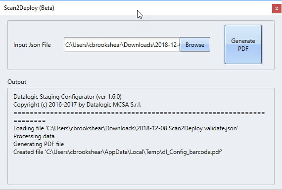
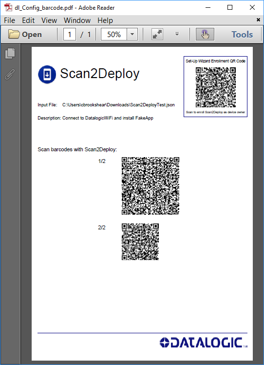

`Scan2Deploy` is an application devoted to the initial staging of devices by reading a barcode sequence. Depending on the content of the staging barcodes `Scan2Deploy` will (in this order)

* configure the device Wi-Fi network,
* control some device inner system settings (e.g. the lock-screen enabled state),
* download a data archive from a HTTP/HTTPS server and unpack it to the device,
* install/update applications and the system image, and
* run a customary script (to perform any additional setup).

It's worth noticing that the application is *not* a resident service. The above-mentioned actions are performed as long as `Scan2Deploy` is active and in use.

### Creating Scan2Deploy files

You will need to create your Scan2Deploy JSON files using a text editor. JSON schemas are provided for both Scan2Deploy Android and Scan2Deploy Windows CE. There are several advantages to using an editor that supports these schemas:

* Provides help text for each field

* Provides real-time compiler-like messages letting you know when you have made a mistake

* Allows you to write files faster and with fewer mistakes

#### Choosing an editor

There are several good JSON editors available. We reccommend [Visual Studio Code](https://code.visualstudio.com/). It is free and has [many features designed to make writing JSON files easier](https://code.visualstudio.com/docs/languages/json), including utilizing JSON schemas.

Visual Studio and Visual Studio Code can be configured to use JSON schemas by including the `$schema` tag in you JSON file. Datalogic has made schemas available for both Android and Windows CE JSON files as follows:

For Android:

```json
{
    "$schema": "http://json.schemastore.org/datalogic-scan2deploy-android"
}
```

For Windows CE:

```json
{
    "$schema": "http://json.schemastore.org/datalogic-scan2deploy-ce"
}
```

Some other editors know to use the schema files on schemastore.org with you give the file a specific extension. The following file extensions are registered on schemastore.org for Dataloigc Scan2Deploy files:

* For Android: *.dla.json
* For Windows CE: *.dlc.json

### Barcode Generation

Scan2Deploy barcodes are generated with the `Scan2Deploy` UI inside DXU Desktop. From the main *Device Configuration Utility* page, click the *Scan2Deploy (Beta)* button:


Once you are at the Scan2Deploy UI page, you can browse to the JSON file you have created and then click `Generate PDF`.



A PDF page will open up in your default PDF viewer, ready for you to print, save, or scan.



### Scan2Deploy Android

In order to describe the JSON input-file structure used for Android devices, we start off by picking an example template file containing all the available parameters, as follows

```json
{
    "$schema": "http://json.schemastore.org/datalogic-scan2deploy-android",
    "layout": {
        "description": "This is for our Android devices",
        "enroll": true
    },
    "padlock": {
        "valid-until": "20991231235959",
        "key": "ihavenomouthandimustscream",
        "state": "locked",
        "hide-from-launcher": false
    },
    "global": {
        "target-path": "/mnt/sdcard/airwatch",
        "install-path": "/mnt/sdcard/airwatch",
        "update-path": "/mnt/sdcard/airwatch",
        "purge-target-path": true,
        "auto-scan": true,
        "script": "setup.s",
        "action": "close",
        "backup-to-enterprise": true
    },
    "settings": {
        "date-time": "Thu, 19 Apr 2018 07:51:37 GMT",
        "auto-time": false,
        "auto-time-zone": false,
        "auto-time-server": "pool.ntp.org",
        "debug-bridge": false,
        "lock-screen": false,
        "status-bar": false,
        "navigation-bar": true,
        "charge-threshold": 0,
        "usb-profile": "NONE",
        "usb-function": "CHARGING"
    },
    "network": {
        "essid": "TESTTKIP",
        "hidden": false,
        "mode": "wpa-psk",
        "mode-key": "datalogic",
        "mode-key-encrypted": false,
        "ephemeral": false,
        "wait-for-connection": true
    },
    "deployment": {
        "scheme": "http",
        "host": "172.19.0.77",
        "port": 8080,
        "path": "/airwatch.zip",
        "ping-timeout": 1000,
        "fetch-timeout": 60000,
        "working-archive": "/mnt/sdcard/target.zip",
        "skip-inflation": true
    },
    "blobs": [
        {
            "file": "/mnt/sdcard/airwatch/credentials.bin",
            "content": "fd09B1iL/k4jRWrjrP0/sO44teY            +B3UafBLsMsCEqd1KOv6b6JYBXLVv70FmHdZhIVoEOQvHu7O4PUJStpZQ+4PYjPqCO+NQr81M7GOF421Ke8L2u4EYyqDE5qXfLy2shEgaRwRpr2f35/38WZkh6edyiWZQJjyLeZcuI7WiaJPpw7Jcw7ye7mb7Rl+ePNFmfvUrpeRFtN+5kUsx/SbB1v0gDyOOuoep"
        }
    ]
}
```

Each section is *optional* in nature. Sections `padlock`, `settings`, `network`, `deployment`, and `blobs` are skipped when missing. Also, for the `settings` section, the configuration parameters are *optional* and when not provided the current setting is kept.

#### Layout

The `layout` section is used to format the output file. The available parameters are the following

* `description`: (optional) Free-form description field (350 max characters). Description will be displayed in header of output file. The default description is `none`.
* `enroll`: (optional) Boolean flag instructing DL-Config to generate Scan2Deploy Device Owner Enrollment QR code in output file. The default value is `false`.

#### Padlock

The `padlock` section is used to configure the staging locking feature. The available parameters are:

* `valid-until`: (optional) Specifies the expiration date of the barcode sequence. In order for this to properly work the device date should be synchronized or at least configured. The default value is `20991231235959`, that is a non-expiring barcode sequence.
* `key`: (optional) Defines the padlock key to be used. If the values doesn't match the device one the barcode is rejected. The default value is the empty string (meaning, no key).
* `state`: (optional) Configures the padlock state. Can be either `locked` indicating that the provided key is possibly set, or `unlocked` in the case device padlock need to be disabled.
* `hide-from-launcher`: (optional) Boolean value that enables the `Scan2Deploy` to be disabled for good once the staging is complete. Please note that once disabled the application can't be re-enabled unless a factory-reset is performed. The default value is `false`.

#### Global

The `global` section is used to configure some application scoped settings. It also specifies

* `target-path`: (optional) This is the base destination folder where any archive/fill will be inflated/written. The default value points to the device internal SD-card root.
* `install-path`: (optional) Folder where the application expects auto-installed/auto-updated APKs are to be found. The default value point to the value specified for the `target-path` parameter.
* `update-path`: (optional) Folder where the application expects auto-updated OTA packages are to be found. The default value point to the value specified for the `target-path` parameter.
* `purge-target-path`: (optional) Boolean value that drives the application behaviour with regards to the target path, that is whether a pre-existing target need to be *purged* (i.e. *deleted*) prior inflation of the deployment archive. The default value is `true` in order to ensure a cleanest-as-possibile deployment.
* `auto-scan`: (optional) Boolean value that enables/disables the auto-installation and auto-update of APKs and OTA packages. The default value is `false`.
* `downgrade-preinstalled`: (optional) Boolean value used to force the downgrade even of (system) pre-installed application, if required. The default value is `false`.
* `script`: (optional) Can be either a string specifying the absolute/relative path of a file, or a JSON array of strings describing the file content line-by-line. The script file will be interpreted and run at the very end of the staging process, after any setting/network/deployment has been completed. The default value is the empty string (i.e. `""`), disabling the script interpretation.
* `action`: (optional) Specifies the final action performed by the application at the very end of the staging process. This can be `none`, `close`, `enterprise-reset`, `factory-reset`, `reset`, or an `intent:`/`android-app://` URI. The default value is `none`.
* `backup-to-enterprise`: (optional) Boolean flag that activates the enterprise backup persistence for the staging data. That means that both the staging script and archive are copied in the enterprise partition. Upon enterprise reset, the application will re-stage the device with such information. The default value is `false`.

#### Settings section

The `settings` sections can be used to controls some inner device settings, that typically need to be changed from the default (Android) setting. The available parameters are the following

* `date-time`: (optional) String representation, in RFC-1123 format, of the date to be set. The default value is `null`, which leave the current device date untouched.
* `auto-time`: (optional) Boolean value controlling the *Date & Time* automatic date-time adjustment setting. The default (Android) value is `true`.
* `auto-time-zone`: (optional) Boolean value controlling the *Date & Time* automatic time-zone adjustment setting. The default (Android) value is `true`.
* `auto-time-server`: (optional) Address of the NTP server to be used for date-time synchronization. Please note that the timezone won't possibly be synched due to lack of a GPS unit in the device. If the server is set a device reboot is suggested for the new setting to be spread system-wide.  The default value is `null`, which leave the default NTP is used (i.e. `asia.pool.ntp.org`).
* `debug-bridge`: (optional) Boolean value controlling the state of *Android Debug Bridge*. The default (Android) value is `true`.
* `lock-screen`: (optional) Boolean value controlling the state of Android's lock-screen, requiring the user to swipe the display to unlock the device. The default (Android) value is `true`.
* `status-bar`: (optional) Boolean value controlling the (top) display status-bar. By hiding the status-bar notifications will disappear, too. The default (Android) value is `true`.
* `navigation-bar`: (optional) Boolean value controlling the (bottom) display navigation-bar. The default (Android) value is `true`.
* `charge-threshold`: (optional) Integer value in the range `0` to `100` indicating the charge threshold a battery exhausted device need to reach to automatically boot when recharging. The default value is `5`.
* `usb-profile`: (optional) USB communication profile in use. Available values are `NONE`, `BOTH`, `DATA`, and `CHARGE`. The default (Android) value is `BOTH`.
* `usb-function`: (optional) USB communication function in use. Available values are `MTP`, `PTP`, and `CHARGING`. The default (Android) value is `CHARGING`.

#### Network

The `network` sections is used to configure the device Wi-Fi network. The available parameters are the following

* `essid`: (optional) The wireless network ESSID. The default value is `tsunami`.
* `hidden`: (optional) Boolean value indicating whether the wireless network is using a hidden ESSID. The default value is `false`.
* `mode`: (optional) The wireless connection mode. Supported values are `open`, `wep-40`, `wep-104`, `wpa-psk`, `wpa2-psk`, `wpa-eap`, and `wpa2-eap`. The default value is `open`.
* `mode-key`: (optional) The wireless network key, if needed. The default value is the empty string (i.e. `""`).
* `mode-key-encrypted`: (optional) Boolean value reporting if the `mode-key` is written in plain-text or encrypted (with a custom encryption algorithm). The default value is `false`.
* `eap-method`: (optional) Configures the EAP authentication method. Supported values are `none`, `peap`, `tls`, `ttls`, `pwd`, `sim`, `aka`, and `aka-prime`. The default value is `none`.
* `eap-phase2`: (optional) Configures the EAP phase 2 authentication method. Supported values are `none`, `pap`, `mschap`, `mschapv2`, and `gtc`.The default value is `none`.
* `eap-identity`: (optional) Indicates the EAP identity. The default value is the empty string (i.e. `""`).
* `eap-anonymous-identity`: (optional) Indicates the EAP anonymous identity, used as the unencrypted identity with certain EAP types. The default value is the empty string (i.e. `""`).
* `eap-password`: (optional) Sets the EAP password, if needed. The default value is the empty string (i.e. `""`).
* `eap-password-encrypted`: (optional) Boolean value reporting if the `eap-password` is written in plain-text or encrypted (with a custom encryption algorithm). The default value is `false`.
* `eap-certificate`: (optional) Base64 representation of the EAP certificate to use. The default value is the empty string (i.e. `""`).
* `proxy-host`: (optional) Server name or IP address of the proxy to be user for HTTP/HTTPS communications. The default value is the empty string (i.e. `""`).
* `proxy-port`: (optional) Server IP port of the proxy for HTTP/HTTPS communications. The default value is `0`.
* `purge`: (optional) Boolean value telling if any currently configured wireless network is to be removed. This can be useful in order to avoid profile roaming. The default value is `true`.
* `reconfigure`: (optional) When the `purge` parameter is set to `false` the wireless network the application is going to set-up could already be existing. This boolean parameter controls the application behavior, that will re-configure any existing and matching network (`true`) or skip it and leave it untouched (`false`).
* `sleep-policy`: (optional) Wireless sleep policy, as for Android's [Settings.Global](https://developer.android.com/reference/android/provider/Settings.Global.html) parameter. Available values are `0` (`WIFI_SLEEP_POLICY_DEFAULT`), `1` (`WIFI_SLEEP_POLICY_NEVER_WHILE_PLUGGED`), and `2` (`WIFI_SLEEP_POLICY_NEVER`). The default value is `2` (i.e. `WIFI_SLEEP_POLICY_NEVER`).
* `frequency-band`: (optional) Controls the frequency bands supported by the device. Supported value are `auto`, `5ghz`, and `2ghz`. The default value is the current device setting (typically `"auto"`).
* `ephemeral`: (optional) If set to `true` the wireless connection profile will be solely used during the staging process, and deleted once complete. When `false` the profile will still be present after the staging process. The default value is `true`.
* `save-to-file`: (optional) Absolute path of the file where the current network configuration will be saved. The default value is the empty string (`""`), indicating that the network configuration will not be serialized to file.
* `wait-for-connection`: (optional) Tells whether a valid Wi-Fi connection has to be waited once the network configuration is complete. Can be useful when the device need to be configured *but* a valid Wi-Fi connection is not ready, yet. The default value is `true`.

#### Deployment

The `deployment` section can be used to download a ZIP archive from a server and inflate it to the `target-path` folder. The available parameters are the following

* `scheme`: (optional) The deployment download scheme to use. Can be either `http` or `https`. The default value is `http`.
* `host`: (mandatory) The host-name or internet-protocol address of the server from which the resource is to be fetched.
* `port`: (optional) TCP/IP port to be used to contact the server. The default value is `80`.
* `path`: (optional) Path to the server resource to download, complete with query-string if needed. The default value is the empty string (`""`).
* `check-timeout`: (optional) The default value is `1000`.
* `fetch-timeout`: (optional) The default value is `60000`.
* `skip-inflation`: (optional) Boolean value instructing the application *not* to inflate the deployment archive once downloaded. This can be useful to speed the OTA update process up. The default value is `false`.
* `working-archive`: (optional) String representation of the local archive path-file name, once downloaded. The default value is `/mnt/sdcard/scan2deploy.archive`.

#### Blobs

The `blobs` (optional) section is a JSON-array of objects. Each object *must* contain the following two attributes

* `file`, the path of the file to be created, and
* `content`, the base64 representation of the actual file content.

The `file` attribute can be either absolute or relative (in this latter case, relative to the `global/target-path` parameter value). During the files de-serialization any required (parent) path is automatically created.

In order to generate the base64 representation of a give binary file any suitable tool can be used (e.g. `base64` command-line program, or online services such as [HexEd.it](https://hexed.it) or [CyberChef](https://gchq.github.io/CyberChef/)).

#### Third-party Integration

The application can be either controller by the user, or programmatically controlled in un-manned manner. This can be achieved by calling the launch intent for the `com.datalogic.android.scan2deploy` package and passing the encoded data representing the configuration to be applied.

```java
Context context = ...; // Android context to be used (e.g. the current activity one)
String data = ...; // Encoded Scan2Deploy configuration
PackageManager packageManager = context.getPackageManager();
Intent launchIntent = packageManager.getLaunchIntentForPackage("com.datalogic.android.scan2deploy");
launchIntent.addFlags(Intent.FLAG_ACTIVITY_NEW_TASK);
launchIntent.putExtra("data", data);
context.startActivity(launchIntent);
```

To obtain the encoded configuration data, the `dl_config.exe` program need to be called with the `--encodeonly=true` flag. In this case, obviously, the output filename is not required. An example output in this case is the following:

```console
> dl_config.exe lock-test.json --encodeonly=true
Datalogic Staging Configurator (ver 1.6.0)
Copyright (c) 2016-2018 by Datalogic MCSA S.r.l.
======================================================================
Loading file 'lock-test.json'
Processing data
-----BEGIN ENCODED DATA-----
Bm9uiYeZ/NWOnA0ZtIrgLMe1iTFLmjusB6P7S4z/lVZ7LFk1d++YM73GqVnqsT9dmxEEuWfR9My93fUA2tUcEv+jxlGNjljHQpXt96BvbVR8bokir3SsXTnFU3qTDeZznLs3PFh+O3n59luLWVNR3c2mFJF5vaGmLue6xHi3bwJgrZOKzs3/bpibCqeNBLcHa/zQRCPQw4=
-----END ENCODED DATA-----
```

The data string to be passed is the ASCII armored sequence (header and trailer included).

As a sidenote, when launched from intent it could be beneficial to specify the global action for the application in order to (for example) automatically close it when the settings have been applied.

#### Scripting Language

During the staging finalization phase, the application can be instructed to interpret and run a custom script, enabling it to perform additional post-staging procedures.

The language structure is a simple one-statement-per-line sequence, executed in order.

Some (the most useful) of the supported commands are the following:

* `DELETE <path> <pattern> <include>`: Recursively deletes files/folders starting from `path`, only if the name matches the `pattern` regular-expression. If `include` is `true` the matching entries will be deleted, the non-matching otherwise. If folder `path` is empty at the end of the process it will be deleted, as well.
* `GRANT <package-name>`: Grants all the permissions declared in the manifest for an application given its `package-name`.
* `INFLATE <archive-path> <target-path>`: Inflates the ZIP archive found at `archive-path` to `target-path` folder.
* `INSTALL <apk-path>`: Installs an application given the path to the containing APK.
* `LAUNCH <package-name>`: Starts the launching intent given an application `package-name`.
* `SHELL <command-with-arguments>`: Runs an arbitrary shell command, similarly to the `ADB shell` command.
* `UNINSTALL <package-name>`: Uninstalls a previously installed application given its `package-name`.
* `UPDATE <ota-path> <reset-type> <force-update>`: Installs a firmware update from an OTA package.
* `WAIT <milliseconds>`: Suspend the script execution for `milliseconds` milliseconds.

### Scan2Deploy Windows CE

`Scan2Deploy` is an application devoted to the initial staging of devices by reading a barcode sequence. Depending on the content of the staging barcodes `Scan2Deploy` will (in this order)

* configure the device Wi-Fi network,
* download a data archive from a HTTP/HTTPS server and unpack it to the device,
* execute a series of shell commands

It's worth noticing that the application is *not* a resident service. The above-mentioned actions are performed as long as `Scan2Deploy` is active and in use.

#### Input File Structure

In order to describe the JSON input-file structure, the following example templates show how the available parameters are used:

Example EAP-FAST and applying a .dxu file:

```json
{
    "$schema": "http://json.schemastore.org/datalogic-scan2deploy-ce",
    "layout": {
      "description": "This is for our WEC7 devices, configures EAP-FAST network and applies .dxu file"
    },
    "global": {
        "target-path": "\\FlashDisk",
        "action": "warm-boot",
    "ping-timeout": 1000
},
"settings": {
    "usb-function": "usblan"
},
"network": {
    "profile": "my_fast",
    "essid": "eapfast",
    "mode": "wpa2-aes",
    "eap-method": "fast",
    "eap-username": "eapfast",
    "eap-password": "1234567890",
    "credentials-type": "password",
    "credentials-source": "profile",
    "validate-server": false,
    "connect-to-server": false,
    "connect-to-server-names": "",
    "server-cert-name": "",
    "outer-identity": "",
    "fast-reconnect": false,
    "inner-method": "eap-MsChapV2",
    "auto-pac": true,
    "pac-file-path": "",
    "pac-aid-info": ""
},
"deployment": {
    "scheme": "http",
    "host": "10.1.20.123",
    "port": 8080,
    "path": "target.zip"
},
"shell": {
    "cmds" : [
        {
            "app-name": "\\windows\\dldxu.exe",
            "args": "\\FlashDisk\\target\\config.dxu"
        }
    ]
}
}
```

Example WPA2-PSK and firmware update:

```json
{
"$schema": "http://json.schemastore.org/datalogic-scan2deploy-ce",
"layout": {
    "description": "This is for our WEC7 devices, configures wpa2-psk network and performs firmware update"
},
"global": {
    "target-path": "\\FlashDisk",
    "action": "close",
    "ping-timeout": 1000
},
"settings": {
    "usb-function": "active-sync-usb"
},
"network": {
    "profile": "my_psk",
    "essid": "tsunami",
    "mode": "wpa2-psk",
    "mode-key": "1234567890",
    "eap-method": "none"
},
"deployment": {
    "scheme": "http",
    "host": "10.1.20.123",
    "port": 8080,
    "path": "target.zip"
},
"shell": {
    "cmds" : [
        {
            "app-name": "\\windows\\fupdate.exe",
            "args": "\\FlashDisk\\target\\nk.img"
        }
    ]
}
}
```

Example WEP, MS-DOS commands, and applying a .dxu file:

```json
{
"$schema": "http://json.schemastore.org/datalogic-scan2deploy-ce",
"layout": {
    "description": "This is for our WEC7 devices, configures WEP network and applies .dxu file"
},
"global": {
    "target-path": "\\",
    "action": "warm-boot",
    "ping-timeout": 1000
},
"settings": {
    "usb-function": "usblan"
},
"network": {
    "profile": "my_wep",
    "essid": "tsunami",
    "mode": "wep-104",
    "mode-key": "1234567890123",
    "index": 1,
    "eap-method": "none"
},
"deployment": {
    "scheme": "http",
    "host": "10.1.20.123",
    "port": 8080,
    "path": "FlashDisk.zip"
},
"shell": {
    "cmds" : [
        {
            "app-name": "\\windows\\cmd.exe",
            "args": "/c copy \\FlashDisk\\config.dxu \\Temp"
        },
        {
            "app-name": "\\windows\\dldxu.exe",
            "args": "\\Temp\\config.dxu"
        },
        {
            "app-name": "\\windows\\cmd.exe",
            "args": "/c del \\Temp\\config.dxu"
        }
    ]
}
}
```

Each section is optional and will be skipped if missing from Json.

#### Layout Section

The `layout` section is used to format the output file. The available parameters are the following

* `description`: (optional) Free-form description field (350 max characters). Description will be displayed in header of output file. The default description is `none`.

#### Global Section

The `global` section is used to configure some application scoped settings. The available parameters are the following

* `target-path`: (optional) This is the base destination folder where any archive/folder will be inflated. The default value is `\FlashDisk`.
* `action`: (optional) Specifies the final action performed by the application at the very end of the staging process. This can be `stay`, `close`, `warm-boot`, `cold-boot`, or `clean-boot`. The default value is `cold-boot`.
* `ping-timeout`: (optional) The timeout value used when attempting to reach the host server. The default value is `1000`.

#### Settings Section

The `settings` section is used to configure some inner device settings. The available parameters are the following

* `usb-function`: (optional) USB communication function in use. Available values are `active-sync-usb`, `active-sync-com`, `usblan`, and `mass-storage`.

The default value is `active-sync-usb`. **Requires reboot for usb setting change to take effect.**

#### Network Section

The `network` section is used to configure the device Wi-Fi network. The available parameters are the following

* `profile`: (optional) The "friendly" name to associate with the network connection. The default value is `datalogic`.
* `essid`: (optional) The wireless network ESSID. The default value is `tsunami`.
* `mode`: (optional) The wireless connection mode. Supported values are `open`, `wep-40`, `wep-104`, `wpa-psk`, `wpa2-psk`, `wpa-tkip`, and `wpa2-aes`. The default value is `open`.
* `mode-key`: (optional) The wireless network key for `wep-40`, `wep-104`, `wpa-psk`, and `wpa2-psk` networks. The default value is the empty string (i.e. `""`).
* `index`: (optional) The wireless network key index for `wep-40` and `wep-104` networks. Supported values are `1`, `2`, `3`, and `4`. The default value is `1`.
* `eap-method`: (optional) Configures the EAP authentication method. Supported values are `none`, `peap`, `tls`, `ttls`, `fast`, and `leap`. The default value is `none`.
* `eap-username`: (optional) The username for the EAP method. The default value is the empty string (i.e. `""`).
* `eap-password`: (optional) The password for the EAP method. The default value is the empty string (i.e. `""`).
* `credentials-type`: (optional) Indicates the EAP credentials type. Supported values are `password`, `token`, `certificate`, and `unknown`. The default value is `password`.
* `credentials-source`: (optional) Indicates the EAP credentials source. Supported values are `user`, `logon`, `profile`, `auto`, and `unknown`. The default value is `user`.
* `validate-server`: (optional) Boolean value indicating if the server certificate should be validated. The default value is `false`.
* `connect-to-server`: (optional) Boolean value indicating if only the servers listed in the `connect-to-server-names` list should be connected to. The default value is `false`.
* `connect-to-server-names`: (optional) Semi-colon separated list of servers that are valid to connect to during server certificate validation. The default value is the empty string (i.e. `""`).
* `server-cert-name`: (optional) The "friendly" name of the server digital certificate that should be validated. The default value is the empty string (i.e. `""`).
* `outer-identity`: (optional)  The outer identity for the EAP method. The default value is the empty string (i.e. `""`).
* `fast-reconnect`: (optional) Boolean value to enable fast reconnect. The default value is `false`.
* `inner-method`: (optional) The inner EAP authentication method to use. Supported values are `eap-tls`, `eap-MsChapV2`, and `eap-gtc`. The default value is `eap-tls`.
* `auto-pac`: (optional) Boolean value indicating if automatic PAC provisioning is used for an EAP-FAST network. The default value is `false`.
* `pac-file-path`: (optional) The full path to the PAC file for manual PAC provisioning. The default value is the empty string (i.e. `""`).
* `pac-aid-info`: (optional) The PAC authority identity (AID) information used to select PAC from a list of PACs on the device. The default value is the empty string (i.e. `""`).

#### Deployment Section

The `deployment` section can be used to download a ZIP archive from a server and inflate it to the `target-path` folder. The available parameters are the following

* `scheme`: (optional) The deployment download scheme to use. Can be either `http` or `https`. The default value is `http`.
* `host`: (mandatory) The host-name or internet-protocol address of the server from which the resource is to be fetched.
* `port`: (optional) TCP/IP port to be used to contact the server. The default value is `80`.
* `path`: (optional) Path to the server resource to download, complete with query-string if needed. The default value is the empty string (`""`).

#### Shell Section

In the final staging phase, Scan2Deploy can be used to perform post-staging procedures, such as to update firmware or apply a .dxu configuration file to the device.
The `shell` section contains the JSON-array `cmds`. Each object in `cmds` is a shell command to execute. The available parameters are the following

* `app-name`: (mandatory) The full path to the application to be executed.
* `args`: (optional) The command line arguments. The default value is the empty string (`""`).
